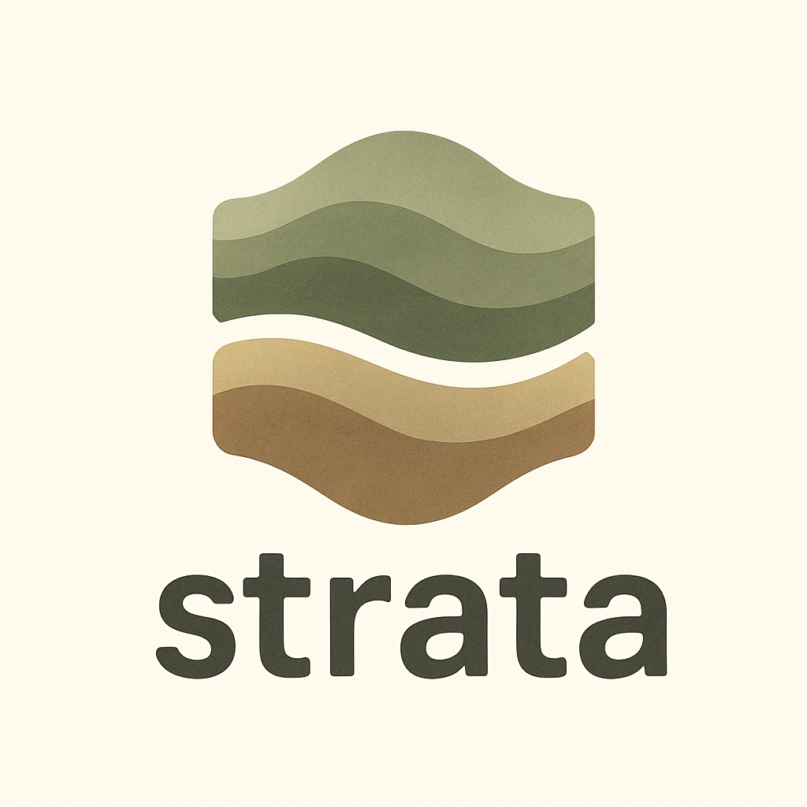

# Strata



Strata is a CLI tool to enhance your Terraform workflows with clear, concise summaries of plan changes. It doesn't modify your Terraform workflow or require any special configuration - it simply provides better visibility into what your Terraform plans will do, helping you make more informed decisions before applying changes.

## Features

### Version Information

Strata provides version information through both a global flag and a dedicated command:

```shell
# Quick version check
$ strata --version
strata version 1.2.3

# Detailed version information
$ strata version
strata version 1.2.3
Built: 2025-01-15T10:30:00Z
Commit: abc123d
Go: go1.24.1

# JSON output for scripts
$ strata version --output json
{
  "version": "1.2.3",
  "build_time": "2025-01-15T10:30:00Z",
  "git_commit": "abc123d",
  "go_version": "go1.24.1"
}
```

### Plan Summaries

The main functionality of Strata is to generate comprehensive summaries of Terraform plan files. You can create a summary using the `strata plan summary` command. For detailed help on this and other commands, add the `--help` flag.

```shell
$ strata plan summary --help

Summarize a Terraform plan file

This command analyzes a Terraform plan file and provides a summary of the changes.
It can read both binary plan files and JSON plan files (from terraform show -json).

The summary includes:
- Plan information (Terraform version, workspace, backend)
- Statistical overview of changes (additions, modifications, deletions, replacements)
- Detailed resource changes with IDs and module information
- Highlighting of potentially dangerous changes

File Output:
The --file and --file-format flags allow you to save output to a file in addition
to displaying it on stdout. The file format can be different from the stdout format.
File paths support placeholders for dynamic naming:
  $TIMESTAMP     - Current timestamp (2006-01-02T15-04-05 format)
  $AWS_REGION    - AWS region from context
  $AWS_ACCOUNTID - AWS account ID from context

Examples:
  strata plan summary terraform.tfplan
  strata plan summary --output json terraform.tfplan
  strata plan summary --danger-threshold 5 terraform.tfplan
  strata plan summary --file output.json --file-format json terraform.tfplan
  strata plan summary --file "report-$TIMESTAMP-$AWS_REGION.md" --file-format markdown terraform.tfplan

Usage:
  strata plan summary [flags] PLAN_FILE

Flags:
      --danger-threshold int   Threshold for highlighting dangerous changes (default 3)
  -h, --help                   help for summary
      --output string          Output format: table, json, html, markdown (default "table")
      --show-details           Show detailed resource changes (default true)
      --highlight-dangers      Highlight potentially dangerous changes (default true)
      --show-statistics        Show statistics summary table (default true)
      --stats-format string    Statistics summary format (horizontal, vertical) (default "horizontal")

Global Flags:
      --config string          config file (default is ./strata.yaml or ~/.strata.yaml)
      --debug                  Enable debug output
      --file string            Optional file to save the output to, in addition to stdout
      --file-format string     Optional format for the file, defaults to the same as output
  -v, --verbose                Enable verbose output
```

Strata assumes that you're providing a valid Terraform plan file, either in binary format (as generated by `terraform plan -out=file.tfplan`) or in JSON format (as generated by `terraform show -json file.tfplan > plan.json`).

### Usage

An example for generating a plan summary would be:

```shell
$ strata plan summary terraform.tfplan
```

This will analyze the plan file and display a comprehensive summary with the following sections:

1. **Plan Information** - Details about the plan file, Terraform version, workspace, and backend
2. **Statistics Summary** - Counts of resources being added, modified, deleted, or replaced
3. **Resource Changes** - Detailed table of all resource changes with IDs and module information
4. **Danger Highlights** - Warning indicators for potentially risky changes


### Output Formats

Strata supports multiple output formats to fit different use cases:

```shell
# Generate summary in JSON format
$ strata plan summary --output json terraform.tfplan

# Generate HTML report and save to file
$ strata plan summary --output html --file report.html terraform.tfplan

# Generate markdown output for documentation
$ strata plan summary --output markdown terraform.tfplan

# Generate table output with custom danger threshold
$ strata plan summary --danger-threshold 5 terraform.tfplan
```

### File Output

Strata provides flexible file output capabilities that allow you to save formatted output to files while simultaneously displaying results on stdout. This is particularly useful for generating reports, documentation, or integrating with CI/CD pipelines.

#### Basic File Output

```shell
# Save table output to file (same format as stdout)
$ strata plan summary --file output.txt terraform.tfplan

# Save as JSON while displaying table on stdout
$ strata plan summary --file output.json --file-format json terraform.tfplan

# Save as HTML report with custom formatting
$ strata plan summary --output table --file report.html --file-format html terraform.tfplan

# Generate markdown documentation
$ strata plan summary --file documentation.md --file-format markdown terraform.tfplan
```

#### Dynamic File Naming with Placeholders

File paths support placeholders for dynamic naming, making it easy to organize outputs by context:

```shell
# Use timestamp in filename
$ strata plan summary --file "report-$TIMESTAMP.json" --file-format json terraform.tfplan

# Include AWS context in filename
$ strata plan summary --file "$AWS_REGION-$AWS_ACCOUNTID-plan.md" --file-format markdown terraform.tfplan

# Comprehensive naming with timestamp and region
$ strata plan summary --file "reports/$AWS_REGION-$TIMESTAMP.html" --file-format html terraform.tfplan
```

**Available Placeholders:**
- `$TIMESTAMP` - Current timestamp in format `2006-01-02T15-04-05`
- `$AWS_REGION` - AWS region from context
- `$AWS_ACCOUNTID` - AWS account ID from context

#### File Output Examples

```shell
# CI/CD Integration - Save JSON for further processing
$ strata plan summary --output table --file "artifacts/plan-$TIMESTAMP.json" --file-format json terraform.tfplan

# Documentation Generation - Create markdown reports
$ strata plan summary --file "docs/infrastructure-changes-$TIMESTAMP.md" --file-format markdown terraform.tfplan

# Multi-format Output - Table for console, HTML for sharing
$ strata plan summary --output table --file "reports/plan-summary.html" --file-format html terraform.tfplan

# Organized Reports - Use placeholders for systematic filing
$ strata plan summary --file "reports/$AWS_REGION/plan-$TIMESTAMP.json" --file-format json terraform.tfplan
```

#### File Output Features

- **Dual Output**: Simultaneously write to stdout and file with different formats
- **Format Flexibility**: File format can differ from stdout format
- **Placeholder Support**: Dynamic file naming with contextual information
- **Path Validation**: Automatic validation of file paths and permissions
- **Security**: Built-in protection against path traversal attacks
- **Error Handling**: Graceful degradation if file writing fails

### Danger Highlights

Strata can identify and highlight potentially dangerous changes in your Terraform plans:

1. **Destructive Changes** - Resources being deleted or replaced
2. **Sensitive Resource Replacements** - Replacement of critical infrastructure components
3. **Sensitive Property Changes** - Modifications to properties that might cause service disruptions
4. **High-Risk Changes** - Sensitive resources with danger flags are counted separately in the statistics summary

You can configure which resources and properties are considered sensitive in your `strata.yaml` configuration file:

```yaml
sensitive_resources:
  - resource_type: aws_db_instance
  - resource_type: aws_ec2_instance
sensitive_properties:
  - resource_type: aws_instance
    property: user_data
```

When a sensitive resource is being replaced or a sensitive property is being modified, Strata will highlight it with a warning indicator (⚠️) and provide details about why the change is considered dangerous.

## Configuration

You can customize Strata's behavior using a configuration file. Strata will look for a file named `strata.yaml` in the current directory or your home directory, or you can specify a custom file using the `--config` flag.

Example configuration:

```yaml
output: table
table:
  style: ColoredBlackOnMagentaWhite
plan:
  danger-threshold: 3
  show-details: true
  highlight-dangers: true
  always-show-sensitive: true  # Always show sensitive resources even when details are disabled

# File output configuration
output-file: "reports/plan-$TIMESTAMP.json"  # Default file output path with placeholder
output-file-format: json                     # Default file format

# Sensitive resources and properties configuration
sensitive_resources:
  - resource_type: aws_db_instance
  - resource_type: aws_ec2_instance
sensitive_properties:
  - resource_type: aws_instance
    property: user_data
```

## GitHub Action

Strata is available as a GitHub Action that can be easily integrated into your CI/CD workflows. The action automatically analyzes Terraform plans and provides summaries in GitHub step summaries and pull request comments.

### Basic Usage

```yaml
- name: Analyze Terraform Plan
  uses: ArjenSchwarz/strata@v1
  with:
    plan-file: terraform.tfplan
```

### Advanced Usage

```yaml
- name: Analyze Terraform Plan
  uses: ArjenSchwarz/strata@v1
  with:
    plan-file: terraform.tfplan
    output-format: markdown
    danger-threshold: 5
    show-details: true
    config-file: .strata.yaml
    comment-on-pr: true
    update-comment: true
    comment-header: "🏗️ Infrastructure Changes"
```

### Required Permissions

**IMPORTANT:** For the GitHub Action to post comments on pull requests, you must configure the proper permissions in your workflow:

```yaml
permissions:
  contents: read
  pull-requests: write  # Required for commenting on PRs
  issues: write         # Required for issue comments (PRs are issues)
```

### Complete Workflow Example

```yaml
name: Terraform Plan Analysis
on:
  pull_request:
    paths: ['**.tf', '**.tfvars']

# REQUIRED: These permissions are needed for PR comments
permissions:
  contents: read
  pull-requests: write
  issues: write

jobs:
  plan-analysis:
    runs-on: ubuntu-latest
    steps:
    - name: Checkout
      uses: actions/checkout@v4
    
    - name: Setup Terraform
      uses: hashicorp/setup-terraform@v3
      
    - name: Terraform Plan
      run: terraform plan -out=terraform.tfplan
      
    - name: Analyze Plan with Strata
      uses: ArjenSchwarz/strata@v1
      with:
        plan-file: terraform.tfplan
        show-details: true
        github-token: ${{ secrets.GITHUB_TOKEN }}
```

### Action Inputs

| Input | Description | Required | Default |
|-------|-------------|----------|----------|
| `plan-file` | Path to Terraform plan file | Yes | |
| `output-format` | Output format (table, json, markdown) | No | `markdown` |
| `config-file` | Path to custom Strata config file | No | |
| `danger-threshold` | Danger threshold for highlighting risks | No | |
| `show-details` | Show detailed change information | No | `false` |
| `github-token` | GitHub token for PR comments | No | `${{ github.token }}` |
| `comment-on-pr` | Whether to comment on PR | No | `true` |
| `update-comment` | Whether to update existing comment | No | `true` |
| `comment-header` | Custom header for PR comments | No | `🏗️ Terraform Plan Summary` |

### Action Outputs

| Output | Description |
|--------|-------------|
| `summary` | Plan summary text |
| `has-changes` | Whether the plan contains changes |
| `has-dangers` | Whether dangerous changes were detected |
| `json-summary` | Full summary in JSON format |
| `change-count` | Total number of changes |
| `danger-count` | Number of dangerous changes |

### Features

- **Step Summary Integration**: Automatically adds rich Markdown summaries to GitHub step summaries
- **Pull Request Comments**: Posts or updates comments on pull requests with plan analysis
- **Multiple Output Formats**: Supports table, JSON, and Markdown output formats
- **Danger Detection**: Highlights potentially risky changes based on configurable thresholds
- **Caching**: Automatically caches Strata binaries for faster execution
- **Error Handling**: Graceful error handling with clear messaging

### GitHub Token Requirements

For the action to post comments on pull requests, your workflow must include the following permissions:

```yaml
permissions:
  contents: read
  pull-requests: write  # Required for commenting on PRs
  issues: write         # Required for issue comments (PRs are issues)
```

**Note:** The action uses the built-in `GITHUB_TOKEN` which is automatically provided by GitHub Actions. No additional token setup is required - just ensure the proper permissions are configured in your workflow.

## Installation

### Prerequisites
- Go 1.24.1 or higher
- Terraform 1.6+ (for testing)

### From Source

```bash
# Clone the repository
git clone https://github.com/yourusername/strata.git
cd strata

# Build the project (includes version information)
make build

# Build with specific version
make build VERSION=1.2.3

# Build release version (requires VERSION parameter)
make build-release VERSION=1.2.3

# Install locally
go install
```

#### Manual Build with Version Information

If you prefer to build manually with version information:

```bash
# Build with version injection
go build -ldflags "-X github.com/ArjenSchwarz/strata/cmd.Version=1.2.3 \
                   -X github.com/ArjenSchwarz/strata/cmd.BuildTime=$(date -u +%Y-%m-%dT%H:%M:%SZ) \
                   -X github.com/ArjenSchwarz/strata/cmd.GitCommit=$(git rev-parse --short HEAD)" .

# Check version
./strata --version
./strata version
./strata version --output json
```

### Using Go Install

```bash
go install github.com/yourusername/strata@latest
```

## Development

Strata uses a standard Go project structure with the following components:

```
strata/
├── cmd/                  # Command-line interface definitions
├── config/               # Configuration management
├── docs/                 # Documentation
├── lib/                  # Core library code
│   └── plan/             # Terraform plan processing
├── main.go               # Application entry point
└── strata.yaml           # Default configuration file
```

### Building and Testing

```bash
# Build the project
make build

# Run tests
make test

# Run sample tests
make run-sample

# Run sample tests with detailed output
make run-sample-details
```

## Recent Changes

Recent additions to Strata include:

- UI Improvements:
  - Horizontal plan information layout for better readability
  - High-risk column in statistics summary to highlight sensitive dangerous changes
  - Always show sensitive resource changes option even when details are disabled
  - Markdown output format support for documentation and pull requests
- Danger Highlights feature for identifying sensitive resource replacements and property changes
- Enhanced plan information display with Terraform version, workspace, and backend details
- Improved resource changes table with physical IDs, replacement indicators, and module information
- Horizontal statistics summary table with clear counts of different change types
- Makefile with standard development targets for building, testing, and running samples

For a complete list of changes, see the [changelog](changelog.md).

## Contributions

If you wish to contribute in any way (reporting bugs, requesting features, writing code), feel free to do so either by opening Issues or Pull Requests. For Pull Requests, just follow the standard pattern:

1. Fork the repository
2. Make your changes
3. Make a pull request that explains what it does

## License

Strata is licensed under the MIT License.