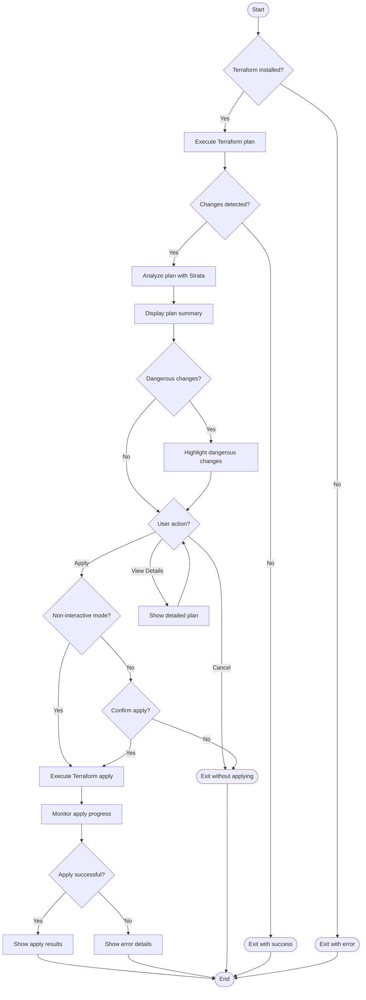

# Design Document: Terraform Workflow

## Overview

The Terraform Workflow feature extends Strata's capabilities to provide a complete workflow that wraps the Terraform plan and apply commands. This design document outlines the technical approach, architecture, components, and interfaces required to implement this feature.

## Architecture

The Terraform Workflow feature will be implemented as a new command in the Strata CLI, following the existing command pattern using Cobra. The feature will integrate with Strata's existing plan analysis capabilities while adding new functionality to execute Terraform commands and manage the interactive workflow.

### High-Level Architecture



## Components and Interfaces

### 1. Command Structure

The feature will be implemented as a new command in the Strata CLI:

```
cmd/
├── root.go           # Root command and global flags
├── plan.go           # Existing plan command group
├── plan_summary.go   # Existing plan summary subcommand
└── apply.go          # New apply command
```

The `apply` command will be registered with the root command and will handle the Terraform workflow.

### 2. Terraform Executor

A new package will be created to handle Terraform command execution:

```
lib/
└── terraform/
    ├── executor.go   # Terraform command execution with go-output progress indicators
    ├── parser.go     # Output parsing
    └── models.go     # Data structures
```

The executor will use go-output's progress indicator feature to provide real-time feedback during Terraform operations. This will allow users to see the status of long-running operations and provide a consistent user experience with other Strata commands.

#### Key Interfaces

```go
// TerraformExecutor handles execution of Terraform commands
type TerraformExecutor interface {
    // Plan executes terraform plan and returns the path to the plan file
    // It uses go-output's progress indicator to show real-time progress
    Plan(ctx context.Context, args []string, progress *output.Progress) (string, error)
    
    // Apply executes terraform apply with the given plan file
    // It uses go-output's progress indicator to show real-time progress
    Apply(ctx context.Context, planFile string, args []string, progress *output.Progress) error
    
    // GetVersion returns the Terraform version
    GetVersion(ctx context.Context) (string, error)
}

// TerraformOutputParser parses Terraform command output
type TerraformOutputParser interface {
    // ParsePlanOutput parses the output of terraform plan
    ParsePlanOutput(output string) (*PlanOutput, error)
    
    // ParseApplyOutput parses the output of terraform apply
    ParseApplyOutput(output string) (*ApplyOutput, error)
}
```

### 3. Interactive Workflow Manager

A new component will be created to manage the interactive workflow:

```
lib/
└── workflow/
    ├── manager.go    # Workflow management
    ├── prompt.go     # User interaction
    └── display.go    # Output formatting using go-output
```

#### Key Interfaces

```go
// WorkflowManager handles the interactive workflow
type WorkflowManager interface {
    // Run executes the workflow
    Run(ctx context.Context, options *WorkflowOptions) error
    
    // PromptForAction prompts the user for action
    PromptForAction(summary *plan.Summary) (Action, error)
    
    // DisplaySummary displays the plan summary using go-output
    DisplaySummary(summary *plan.Summary) error
    
    // DisplayDetails displays detailed plan output using go-output
    DisplayDetails(planOutput string) error
}

// Action represents user actions in the workflow
type Action int

const (
    ActionApply Action = iota
    ActionViewDetails
    ActionCancel
)
```

### 4. Integration with Existing Plan Analysis

The workflow will integrate with Strata's existing plan analysis capabilities:

```go
// Analyze the plan file
planFile, err := executor.Plan(ctx, args)
if err != nil {
    return err
}

// Use existing plan analysis
summary, err := analyzer.AnalyzePlan(planFile)
if err != nil {
    return err
}

// Display summary using existing formatter with go-output
err = formatter.FormatSummary(summary, options.OutputFormat)
if err != nil {
    return err
}
```

All output formatting will leverage the go-output library to ensure consistency with the rest of Strata. If any output requirements cannot be met with the current go-output capabilities, we will identify these as improvements needed for the go-output library rather than implementing alternative formatting approaches.

## Data Models

### 1. Workflow Options

```go
// WorkflowOptions contains options for the Terraform workflow
type WorkflowOptions struct {
    // TerraformPath is the path to the Terraform binary
    TerraformPath string
    
    // WorkingDir is the directory to execute Terraform commands in
    WorkingDir string
    
    // PlanArgs are additional arguments for terraform plan
    PlanArgs []string
    
    // ApplyArgs are additional arguments for terraform apply
    ApplyArgs []string
    
    // NonInteractive indicates whether to run in non-interactive mode
    NonInteractive bool
    
    // Force indicates whether to force apply in non-interactive mode
    Force bool
    
    // OutputFormat is the format for output
    OutputFormat string
    
    // DangerThreshold is the threshold for dangerous changes
    DangerThreshold int
}
```

### 2. Command Output Models

```go
// PlanOutput contains parsed output from terraform plan
type PlanOutput struct {
    // HasChanges indicates whether the plan has changes
    HasChanges bool
    
    // ResourceChanges contains the number of resource changes
    ResourceChanges struct {
        Add       int
        Change    int
        Destroy   int
    }
    
    // RawOutput is the raw output from terraform plan
    RawOutput string
}

// ApplyOutput contains parsed output from terraform apply
type ApplyOutput struct {
    // Success indicates whether the apply was successful
    Success bool
    
    // ResourceChanges contains the number of resource changes applied
    ResourceChanges struct {
        Added     int
        Changed   int
        Destroyed int
    }
    
    // Error contains error information if the apply failed
    Error string
    
    // RawOutput is the raw output from terraform apply
    RawOutput string
}
```

## Error Handling

The feature will implement comprehensive error handling:

1. **Command Execution Errors**: Errors from Terraform command execution will be captured and displayed with context.
2. **Plan Analysis Errors**: Errors from plan analysis will be handled gracefully.
3. **User Input Errors**: Invalid user input will be handled with clear error messages.
4. **Terraform Not Found**: The system will check for Terraform installation and provide a helpful error if not found.

Error messages will follow Strata's existing error format and will include:
- Error code
- Error message
- Suggested resolution
- Context information

## Testing Strategy

The testing strategy will include:

1. **Unit Tests**:
   - Test Terraform executor with mocked command execution
   - Test output parsing with sample outputs
   - Test workflow manager with mocked dependencies

2. **Integration Tests**:
   - Test with simple Terraform configurations
   - Test with various plan scenarios (create, update, delete)
   - Test error handling with invalid configurations

3. **End-to-End Tests**:
   - Test the complete workflow with real Terraform commands
   - Test with different output formats
   - Test non-interactive mode

## Configuration Integration

The feature will integrate with Strata's existing configuration system:

```yaml
# Example configuration in strata.yaml
terraform:
  # Path to Terraform binary
  path: /usr/local/bin/terraform
  
  # Default arguments for plan
  plan-args: "-input=false"
  
  # Default arguments for apply
  apply-args: "-input=false"
  
  # Backend configuration (optional, will use Terraform's default behavior if not specified)
  backend:
    # Type of backend (e.g., s3, gcs, azurerm)
    type: s3
    # Backend-specific configuration
    config:
      bucket: "my-terraform-state"
      key: "path/to/state"
      region: "us-west-2"
  
  # Danger threshold for highlighting risks
  danger-threshold: 3
  
  # Whether to show detailed output by default
  show-details: false
```

Configuration will be loaded from the default locations and can be overridden with command-line flags.

## User Experience Considerations

1. **Real-time Output**: Terraform command output will be streamed in real-time to provide immediate feedback.
2. **Clear Prompts**: User prompts will be clear and concise, with options clearly labeled.
3. **Consistent Formatting**: Output formatting will use the go-output library for all outputs to maintain consistency with existing Strata commands.
4. **Progress Indicators**: Progress indicators will be displayed during long-running operations using go-output's progress indicator feature, which provides real-time updates on operation status.
5. **Color Coding**: Color coding will be used to highlight important information (e.g., destructive changes) using go-output's styling capabilities.

## Security Considerations

1. **Sensitive Data**: Care will be taken to avoid exposing sensitive data in logs or output.
2. **Confirmation for Destructive Changes**: Destructive changes will require explicit confirmation.
3. **Terraform State**: The feature will not modify Terraform state directly, only through Terraform commands.
4. **Command Injection**: User input will be sanitized to prevent command injection.

## Remote State Support

The implementation will include support for Terraform remote state backends:

1. **Backend Detection**: The system will detect and respect the backend configuration in the Terraform files.
2. **State Locking**: The system will handle state locking appropriately during plan and apply operations.
3. **Error Handling**: Specific error handling for remote state issues (e.g., permission errors, state lock errors).
4. **Configuration**: Support for backend configuration through Terraform's standard mechanisms.

## Future Enhancements

While not part of the initial implementation, the following enhancements could be considered for future versions:

1. **Workspace Management**: Support for managing Terraform workspaces.
2. **Variable Management**: Support for managing Terraform variables.
3. **Plan Comparison**: Support for comparing multiple plans.
4. **Cost Estimation**: Integration with cost estimation tools.