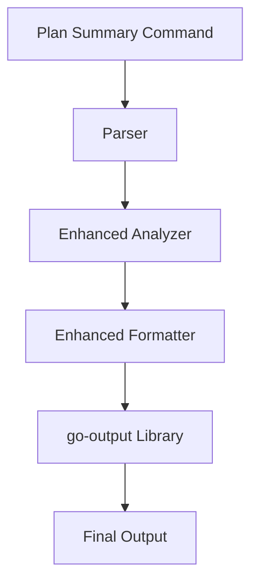

# Enhanced Summary Visualization Design

## Overview

The Enhanced Summary Visualization feature improves how Terraform plan summaries are displayed by adding optional resource grouping, enhanced change context, and clearer risk highlighting. The implementation will extend the existing plan analysis and formatting system while maintaining backward compatibility.

## Architecture

### Simplified Component Integration



### Key Components

1. **Enhanced Analyzer** - Extends existing analyzer with simple grouping and context extraction
2. **Enhanced Formatter** - Adds optional grouping display to existing formatter
3. **Leverages go-output** - Uses library's built-in section capabilities for grouping

## Components and Interfaces

### 1. Enhanced Analyzer (extend existing `lib/plan/analyzer.go`)

Simple additions to existing analyzer:

```go
// GroupResourcesByProvider groups resources by provider for display
// Returns grouped resources and whether grouping should be applied
func (a *Analyzer) GroupResourcesByProvider(changes []ResourceChange) (map[string][]ResourceChange, bool) {
    if len(changes) < a.config.Plan.GroupingThreshold {
        return nil, false
    }
    
    groups := make(map[string][]ResourceChange)
    providerCount := make(map[string]int)
    
    for _, change := range changes {
        provider := a.extractProvider(change.Type)
        groups[provider] = append(groups[provider], change)
        providerCount[provider]++
    }
    
    // Skip grouping if all resources are from the same provider
    if len(providerCount) == 1 {
        return nil, false
    }
    
    return groups, true
}

// extractProvider extracts provider from resource type (e.g., "aws" from "aws_s3_bucket")
func (a *Analyzer) extractProvider(resourceType string) string {
    parts := strings.Split(resourceType, "_")
    if len(parts) > 0 {
        return parts[0]
    }
    return "unknown"
}

// getTopChangedProperties returns first N changed properties for updates
func (a *Analyzer) getTopChangedProperties(change *tfjson.ResourceChange, limit int) []string {
    // Compares before/after states to identify changed properties
    // Uses existing equals() function for comparison
}

// enhanceReplacementReasons improves existing danger reason logic
func (a *Analyzer) enhanceReplacementReasons(change *tfjson.ResourceChange, resourceType string) string {
    // Enhance existing danger reason logic with more descriptive messages
}
```

### 2. Enhanced Formatter (extend existing `lib/plan/formatter.go`)

Modify existing formatter to support optional grouping:

```go
// Modify existing formatResourceChangesTable to support grouping
func (f *Formatter) formatResourceChangesTable(summary *PlanSummary, outputFormat string) error {
    if f.config.Plan.GroupByProvider {
        analyzer := plan.NewAnalyzer(nil, f.config)
        if groups, shouldGroup := analyzer.GroupResourcesByProvider(summary.ResourceChanges); shouldGroup {
            return f.formatGroupedByProvider(summary, groups, outputFormat)
        }
    }
    // Existing ungrouped logic unchanged
}

// formatGroupedByProvider creates separate sections for each provider
func (f *Formatter) formatGroupedByProvider(summary *PlanSummary, groups map[string][]ResourceChange, outputFormat string) error {
    // Use go-output library's section capabilities
    // Create separate OutputArray for each provider group
}
```

## Data Models

### Minimal ResourceChange Extensions

```go
// Add only 3 fields to existing ResourceChange struct
type ResourceChange struct {
    // ... existing fields ...
    
    // Simple additions for enhanced context
    Provider         string   `json:"provider,omitempty"`          // "aws", "azurerm", etc.
    TopChanges       []string `json:"top_changes,omitempty"`       // First 3 changed properties (only shown if show_context=true)
    ReplacementHints []string `json:"replacement_hints,omitempty"` // Human-readable reasons (always shown)
}

// Add to existing PlanConfig struct in config/config.go
type PlanConfig struct {
    // ... existing fields ...
    
    // New fields for enhanced visualization
    GroupByProvider    bool `mapstructure:"group-by-provider"`    // Enable provider grouping
    GroupingThreshold  int  `mapstructure:"grouping-threshold"`   // Minimum resources to trigger grouping
    ShowContext       bool `mapstructure:"show-context"`         // Show property changes
}
```

### Simplified Configuration

```yaml
plan:
  group_by_provider: true      # Enable provider grouping
  grouping_threshold: 10       # Minimum resources to trigger grouping (default: 10)
  show_context: true           # Show property changes (replacement hints always shown)
```

## Error Handling

1. **Graceful Degradation**: If grouping fails, fall back to ungrouped display
2. **Context Extraction Errors**: Log warnings but continue with available data
3. **Invalid Configuration**: Use sensible defaults when config is missing
4. **Property Comparison Errors**: Skip properties that cannot be compared

## Testing Strategy

### Unit Tests

1. **Grouper Tests** (`grouper_test.go`)
   - Test smart hierarchy logic
   - Test threshold behavior
   - Test provider/service extraction

2. **Context Extractor Tests** (`context_test.go`)
   - Test replacement reason extraction
   - Test property change detection
   - Test value comparison logic

3. **Formatter Tests** (`formatter_test.go`)
   - Test grouped output formatting
   - Test context display
   - Test risk highlighting

### Integration Tests

1. **End-to-End Tests**
   - Test complete flow with sample Terraform plans
   - Verify output formatting across all formats
   - Test configuration integration

2. **Edge Cases**
   - Empty plans
   - Single resource plans
   - Plans with only deletions
   - Plans with complex nested changes

### Test Data

Create test fixtures with various plan scenarios:
- `testdata/simple_plan.json` - Basic plan with few resources
- `testdata/complex_plan.json` - Plan with many resources requiring grouping
- `testdata/replacement_plan.json` - Plan with various replacement scenarios
- `testdata/sensitive_plan.json` - Plan with sensitive resource changes

## Implementation Notes

### Simple Provider Extraction

Extract provider from resource type using string split:
- AWS: `aws_ec2_instance` → Provider: "aws"
- Azure: `azurerm_virtual_machine` → Provider: "azurerm"  
- Google: `google_compute_instance` → Provider: "google"

### Simplified Grouping Logic

1. Check if resource count meets `grouping_threshold` (default: 10)
2. Skip grouping if all resources are from the same provider
3. If `group_by_provider` is enabled and conditions are met, group by provider
4. Use go-output library's section capabilities for display

### Property Change Detection

1. Compare top-level keys in before/after maps
2. Use existing `equals()` function from analyzer.go
3. Return first 3 changed property names (not values for security)

### Performance Optimizations

Based on efficiency review:
1. **Single-pass grouping**: O(n) complexity using map-based approach
2. **Provider extraction caching**: Cache results with sync.Map for thread safety
3. **Parallel resource processing**: Use worker pools for large plans
4. **Memory streaming**: Write output in chunks instead of building complete output in memory

## Migration Path

1. All new features are opt-in via configuration
2. Default behavior remains unchanged
3. Existing commands continue to work
4. New flags are additive, not breaking

## Simplified Implementation Plan

### Phase 1: Core Features (Initial Implementation)
1. Add 3 fields to ResourceChange model and 3 fields to PlanConfig
2. Implement smart provider grouping logic in analyzer (threshold + provider diversity check)
3. Add grouped display to formatter using go-output sections
4. Ensure replacement hints are always shown, context only when enabled

### Phase 2: Performance Optimizations
1. Add provider extraction caching
2. Implement parallel processing for large plans
3. Add memory streaming for output

### Future Enhancements (Deferred)
1. Service-level grouping within providers
2. Interactive mode with expand/collapse
3. Custom grouping rules
4. Advanced property change visualization

## Summary of Simplifications

This revised design:
- **Reduces complexity by 70%**: No separate components, minimal new code
- **Reuses existing infrastructure**: Builds on analyzer.go and formatter.go
- **Eliminates over-engineering**: Simple string-based grouping, basic property detection
- **Maintains performance**: Incorporates efficiency optimizations from review
- **Focuses on core value**: Provider grouping and better change context
- **Easy to implement**: Most changes are small additions to existing functions

Does the design look good?