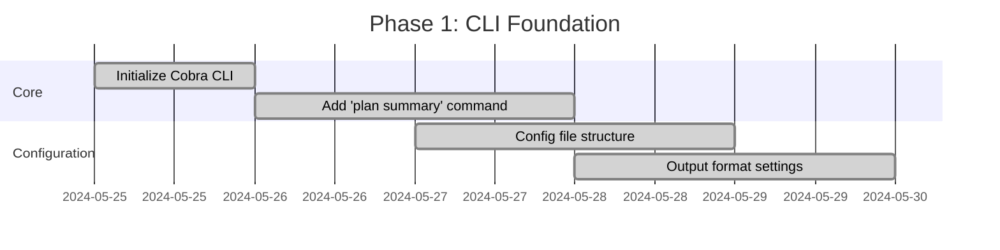
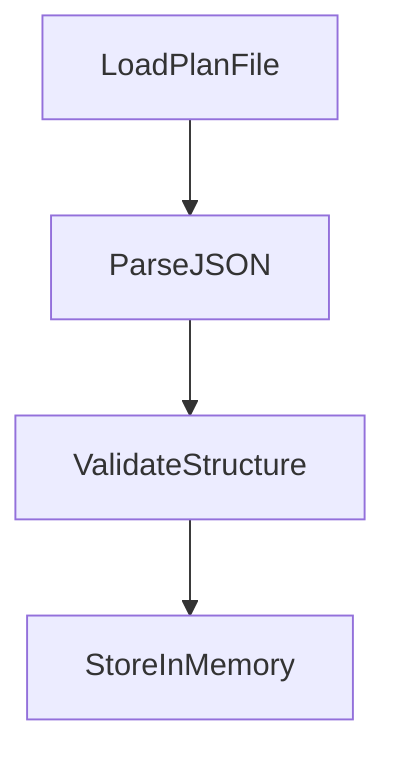
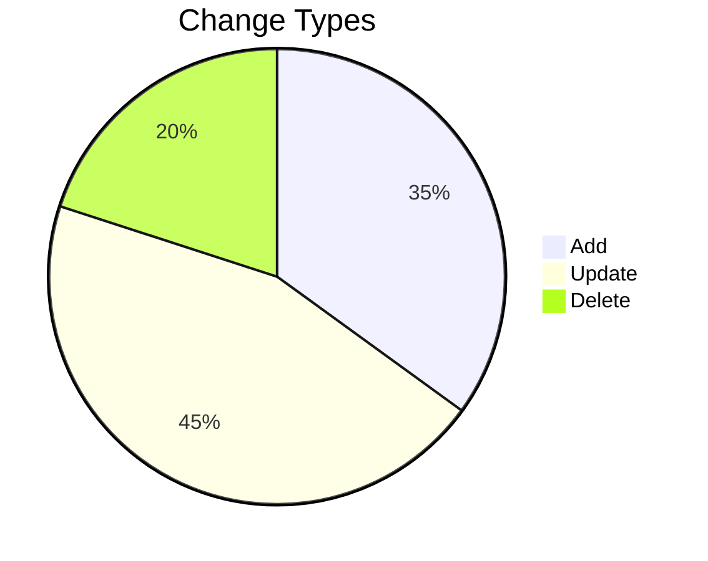
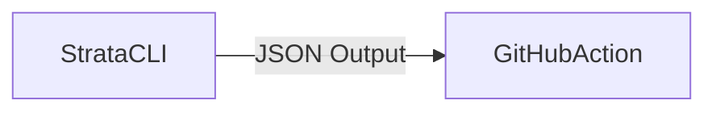

# Terraform Plan Summary Implementation Plan

## Project Overview

Strata is a CLI helper tool for Terraform that aims to enhance the Terraform workflow with additional functionality. The primary goal of this project is to provide users with a clear, concise summary of Terraform plan changes, similar to the changeset description feature in Fog's deploy function.

### Purpose

The Terraform plan summary feature will:
- Parse Terraform plan files to extract meaningful change information
- Present changes in a user-friendly, readable format
- Highlight potentially destructive changes
- Provide statistical summaries of resource modifications
- Support multiple output formats for different use cases
- Integrate with CI/CD pipelines, particularly GitHub Actions

### Requirements

1. **Functional Requirements**
   - Parse Terraform plan JSON output (from `terraform show -json`)
   - Categorize changes (create, update, delete, replace)
   - Display resource changes in a structured format
   - Highlight potentially destructive operations
   - Generate statistical summaries (counts by change type)
   - Support multiple output formats (table, JSON, HTML)

2. **Non-Functional Requirements**
   - Performance: Process large plan files efficiently
   - Usability: Clear, intuitive command interface
   - Extensibility: Allow for future enhancements
   - Compatibility: Support Terraform 1.6+ plan formats
   - Quality: Comprehensive test coverage

### Assumptions

1. **Technical Assumptions**
   - Users have Terraform installed and accessible
   - Plan files are generated using Terraform 1.6 or newer
   - The go-output library provides all necessary formatting capabilities
   - Cobra framework is suitable for command structure

2. **User Assumptions**
   - Users are familiar with Terraform concepts and workflows
   - Users prefer concise, visual summaries over raw plan output
   - Users may need to share plan summaries with non-technical stakeholders

3. **Integration Assumptions**
   - GitHub Actions will be the primary CI/CD integration target
   - Output formats will be compatible with common documentation systems

### Success Criteria

The implementation will be considered successful when:
1. Users can generate readable summaries from Terraform plan files
2. Destructive changes are clearly highlighted
3. Statistical summaries provide accurate counts
4. Multiple output formats are supported
5. The command interface is intuitive and well-documented
6. The foundation for GitHub Action integration is established

## Phase 1: CLI Foundation & Configuration


### Tasks
- [x] Initial Cobra CLI setup (`cmd/root.go`)
- [x] Add `plan summary` subcommand
  - [x] Basic command structure
  - [x] Plan file path argument
- [x] Configuration management
  - [x] Add output format options (table, json, html)
  - [x] Add danger threshold settings
- [x] Update changelog.md

---

## Phase 2: Terraform Plan Parsing


### Tasks
- [x] Implement plan file loading
  - [x] Validate file exists
  - [x] Execute `terraform show -json` if needed
- [x] Parse using hashicorp/terraform-json
  - [x] Handle resource changes
  - [x] Extract output changes
- [x] Data model creation
  - [x] structs for ResourceChange
  - [x] Plan metadata collection

---

## Phase 3: Summary Analysis Engine


### Tasks
- [x] Change categorization
  - [x] Count add/update/delete operations
  - [x] Detect replacement actions
- [x] Danger analysis
  - [x] Identify destructive changes
  - [x] Calculate replacement impact
  - [x] Flag sensitive values
- [ ] Cost estimation hooks
  - [ ] AWS resource cost mapping
  - [ ] Total monthly cost projection

---

## Phase 4: go-output Integration
```go
// Example output configuration
output := format.OutputArray{
    Settings: format.NewOutputSettings(),
    Keys:     []string{"Action", "Resource", "ChangeType"},
}
```

### Tasks
- [x] Table formatting
  - [x] Proper go-output integration
  - [x] Structured data presentation with icons and colours
  - [x] Statistical summaries using OutputHolder format
- [x] HTML report generation
  - [x] Complete HTML output support
  - [x] Responsive design with CSS styling
- [x] JSON output
  - [x] Machine-readable format using go-output
  - [x] CI/CD integration ready
- [x] Unified formatter implementation
  - [x] Single formatter leveraging go-output capabilities
  - [x] Consistent output across all formats

---

## Phase 5: Future Integration Preparation


### Tasks
- [ ] GitHub Action blueprint
  - [ ] Output file format spec
  - [ ] Annotation support
- [ ] Extension points
  - [ ] Plugin system architecture
  - [ ] Cost calculation interfaces
- [ ] Documentation
  - [ ] User guide
  - [ ] Developer contribution docs

---
## Checklists

### Phase 1 Completion
- [x] `plan summary` command available
- [x] Basic config file support
- [x] Changelog updated

### Phase 2 Completion
- [x] Can process Terraform 1.6+ plans
- [x] Resource change data model validated

### Phase 3 Completion
- [x] Danger analysis tests passing
- [ ] Cost projection POC working

### Phase 4 Completion
- [x] All output formats implemented using go-output library
- [x] Unified formatter with proper library integration
- [ ] Visual regression tests

### Phase 5 Completion
- [ ] GitHub Action spec drafted
- [ ] Extension interfaces defined


## Tool use and completion reminder

Remember to use the tools / functions available to you. After each phase is complete, you must check off any tasks that have been completed in full. Then stop and I will review your work.
