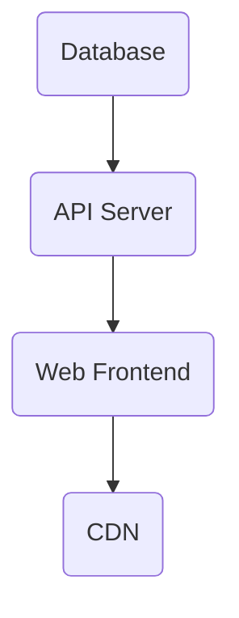
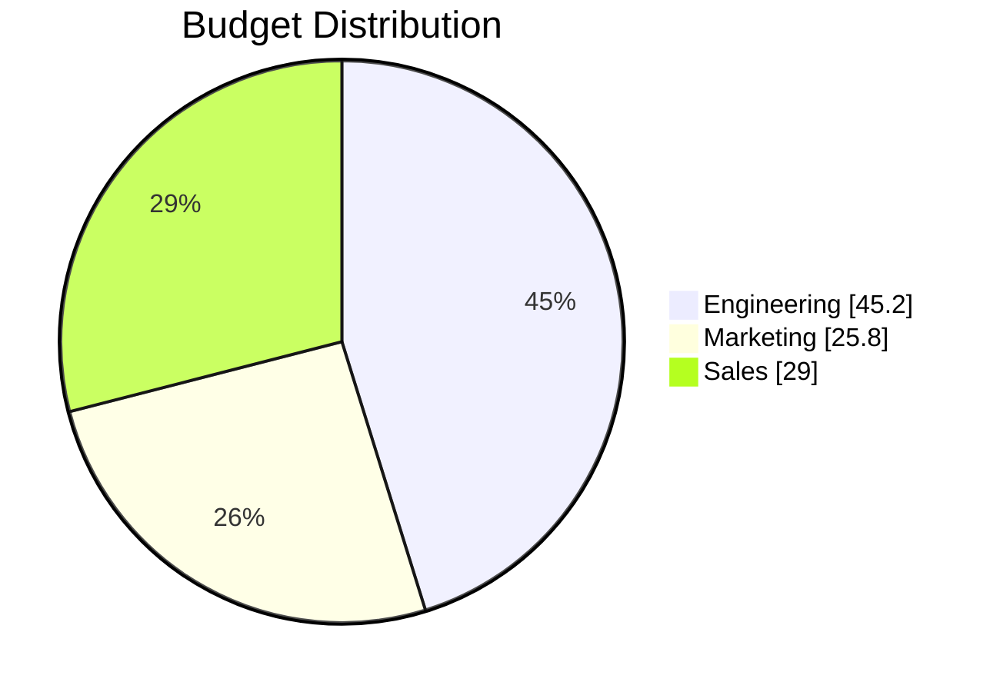

# Mermaid Diagrams

The go-output library provides comprehensive support for generating Mermaid diagrams, including flowcharts, pie charts, and Gantt charts. This guide covers all aspects of Mermaid diagram generation.

## Overview

Mermaid is a popular diagramming and charting tool that uses text-based definitions to create diagrams. The library supports three types of Mermaid diagrams:

- **Flowcharts**: For showing relationships and processes
- **Pie Charts**: For displaying proportional data
- **Gantt Charts**: For project timelines and scheduling

## Basic Setup

### Requirements

For Mermaid output, you need to configure the MermaidSettings:

```go
settings := format.NewOutputSettings()
settings.SetOutputFormat("mermaid")
settings.MermaidSettings = &mermaid.Settings{
    AddMarkdown: true,  // Wrap in markdown code blocks
    AddHTML:     false, // Add HTML script tags for rendering
    ChartType:   "flowchart", // Chart type
}
```

### Output Options

```go
// Markdown code block output (default)
settings.MermaidSettings.AddMarkdown = true
// Output: ```mermaid\n[diagram]\n```

// HTML with script tags
settings.MermaidSettings.AddHTML = true
// Output: <script>mermaid.initialize({startOnLoad: true});</script>

// Plain text output
settings.MermaidSettings.AddMarkdown = false
settings.MermaidSettings.AddHTML = false
// Output: [raw mermaid syntax]
```

## Flowcharts

Flowcharts show relationships between entities using nodes and edges.

### Basic Configuration

```go
settings := format.NewOutputSettings()
settings.SetOutputFormat("mermaid")
settings.MermaidSettings.ChartType = "flowchart"  // or "" for default
settings.AddFromToColumns("Source", "Target")
```

### Data Structure

Your data must include source and target columns:

```go
relationships := []format.OutputHolder{
    {
        Contents: map[string]interface{}{
            "Source": "Database",
            "Target": "API Server",
            "Type":   "queries",
        },
    },
    {
        Contents: map[string]interface{}{
            "Source": "API Server",
            "Target": "Web Frontend",
            "Type":   "HTTP requests",
        },
    },
    {
        Contents: map[string]interface{}{
            "Source": "Web Frontend",
            "Target": "CDN",
            "Type":   "static assets",
        },
    },
}
```

### Example Output



### Advanced Flowchart Features

```go
// Create flowchart programmatically
flowchart := mermaid.NewFlowchart(settings.MermaidSettings)

// Set direction (default: TB - Top to Bottom)
flowchart.Direction = "LR"  // Left to Right
// Options: TB, TD, BT, RL, LR

// Add nodes
flowchart.AddBasicNode("Start")
flowchart.AddBasicNode("Process")
flowchart.AddBasicNode("End")

// Add edges
flowchart.AddEdgeByNames("Start", "Process")
flowchart.AddEdgeByNames("Process", "End")

// Generate output
output := flowchart.RenderString()
```

## Pie Charts

Pie charts display proportional data as segments of a circle.

### Configuration

```go
settings := format.NewOutputSettings()
settings.SetOutputFormat("mermaid")
settings.MermaidSettings.ChartType = "piechart"
settings.AddFromToColumns("Category", "Value")  // Value must be float64
```

### Data Structure

Values must be numeric (float64):

```go
budgetData := []format.OutputHolder{
    {
        Contents: map[string]interface{}{
            "Category": "Engineering",
            "Value":    45.2,
            "Budget":   "Q1 2024",
        },
    },
    {
        Contents: map[string]interface{}{
            "Category": "Marketing",
            "Value":    25.8,
            "Budget":   "Q1 2024",
        },
    },
    {
        Contents: map[string]interface{}{
            "Category": "Sales",
            "Value":    29.0,
            "Budget":   "Q1 2024",
        },
    },
}
```

### Example Output



### Programmatic Pie Chart Creation

```go
// Create pie chart directly
pieChart := mermaid.NewPiechart(settings.MermaidSettings)
pieChart.Title = "Revenue by Region"
pieChart.ShowData = true

// Add values
pieChart.AddValue("North America", 45.5)
pieChart.AddValue("Europe", 32.1)
pieChart.AddValue("Asia Pacific", 22.4)

// Generate output
output := pieChart.RenderString()
```

## Gantt Charts

Gantt charts display project timelines and task scheduling.

### Configuration

```go
settings := format.NewOutputSettings()
settings.SetOutputFormat("mermaid")
settings.MermaidSettings.ChartType = "ganttchart"
settings.MermaidSettings.GanttSettings = &mermaid.GanttSettings{
    LabelColumn:     "Task",
    StartDateColumn: "StartTime",
    DurationColumn:  "Duration",
    StatusColumn:    "Status",
}
```

### Data Structure

```go
projectTasks := []format.OutputHolder{
    {
        Contents: map[string]interface{}{
            "Task":      "Requirements Analysis",
            "StartTime": "09:00:00",
            "Duration":  "2h",
            "Status":    "done",
        },
    },
    {
        Contents: map[string]interface{}{
            "Task":      "Design Phase",
            "StartTime": "11:00:00",
            "Duration":  "4h",
            "Status":    "active",
        },
    },
    {
        Contents: map[string]interface{}{
            "Task":      "Implementation",
            "StartTime": "15:00:00",
            "Duration":  "6h",
            "Status":    "",  // No status
        },
    },
}
```

### Example Output



```mermaid
gantt
    title Project Timeline
    dateFormat HH:mm:ss
    axisFormat %H:%M:%S
    Requirements Analysis  :done, 09:00:00 , 2h
    Design Phase          :active, 11:00:00 , 4h
    Implementation        :15:00:00 , 6h
```

### Advanced Gantt Features

```go
// Create Gantt chart programmatically
ganttChart := mermaid.NewGanttchart(settings.MermaidSettings)
ganttChart.Title = "Development Schedule"
ganttChart.DateFormat = "YYYY-MM-DD"  // Default: HH:mm:ss
ganttChart.AxisFormat = "%Y-%m-%d"    // Default: %H:%M:%S

// Get default section
section := ganttChart.GetDefaultSection()

// Add tasks to section
section.AddTask("Planning", "2024-01-01", "1w", "done")
section.AddTask("Development", "2024-01-08", "3w", "active")
section.AddTask("Testing", "2024-01-29", "1w", "")

// Generate output
output := ganttChart.RenderString()
```

### Gantt Sections

```go
// Create chart with custom sections
ganttChart := mermaid.NewGanttchart(settings.MermaidSettings)

// Add custom sections (not directly supported in current API)
// Note: Current implementation uses a default section
defaultSection := ganttChart.GetDefaultSection()
defaultSection.Title = "Phase 1"
```

## Settings Configuration

### Mermaid Settings Structure

```go
type Settings struct {
    AddMarkdown   bool           // Wrap in markdown code blocks
    AddHTML       bool           // Add HTML script tags
    ChartType     string         // "flowchart", "piechart", "ganttchart"
    GanttSettings *GanttSettings // Gantt-specific configuration
}

type GanttSettings struct {
    LabelColumn     string // Column containing task names
    StartDateColumn string // Column containing start times/dates
    DurationColumn  string // Column containing durations
    StatusColumn    string // Column containing task status
}
```

### HTML Integration

When `AddHTML = true`, the output includes JavaScript for rendering:

```go
settings.MermaidSettings.AddHTML = true
```

Output includes:
```html
<script src="https://cdn.jsdelivr.net/npm/mermaid/dist/mermaid.min.js"></script>
<script>
    mermaid.initialize({ startOnLoad: true });
</script>
```

## Complete Examples

### Architecture Diagram

```go
func generateArchitectureDiagram() {
    // Architecture components
    components := []format.OutputHolder{
        {Contents: map[string]interface{}{"From": "User", "To": "Load Balancer"}},
        {Contents: map[string]interface{}{"From": "Load Balancer", "To": "Web Server 1"}},
        {Contents: map[string]interface{}{"From": "Load Balancer", "To": "Web Server 2"}},
        {Contents: map[string]interface{}{"From": "Web Server 1", "To": "Database"}},
        {Contents: map[string]interface{}{"From": "Web Server 2", "To": "Database"}},
        {Contents: map[string]interface{}{"From": "Database", "To": "Cache"}},
    }

    settings := format.NewOutputSettings()
    settings.SetOutputFormat("mermaid")
    settings.MermaidSettings = &mermaid.Settings{
        AddMarkdown: true,
        ChartType:   "flowchart",
    }
    settings.AddFromToColumns("From", "To")
    settings.Title = "System Architecture"

    output := format.OutputArray{
        Settings: settings,
        Contents: components,
        Keys:     []string{"From", "To"},
    }

    output.Write()
}
```

### Budget Analysis

```go
func generateBudgetChart() {
    budget := []format.OutputHolder{
        {Contents: map[string]interface{}{"Department": "Engineering", "Amount": 450000.0}},
        {Contents: map[string]interface{}{"Department": "Marketing", "Amount": 280000.0}},
        {Contents: map[string]interface{}{"Department": "Sales", "Amount": 320000.0}},
        {Contents: map[string]interface{}{"Department": "Operations", "Amount": 150000.0}},
    }

    settings := format.NewOutputSettings()
    settings.SetOutputFormat("mermaid")
    settings.MermaidSettings = &mermaid.Settings{
        AddMarkdown: true,
        ChartType:   "piechart",
    }
    settings.AddFromToColumns("Department", "Amount")
    settings.Title = "Annual Budget Distribution"

    output := format.OutputArray{
        Settings: settings,
        Contents: budget,
        Keys:     []string{"Department", "Amount"},
    }

    output.Write()
}
```

### Project Timeline

```go
func generateProjectTimeline() {
    tasks := []format.OutputHolder{
        {Contents: map[string]interface{}{
            "Phase": "Planning", "Start": "2024-01-01", "Duration": "1w", "Status": "done",
        }},
        {Contents: map[string]interface{}{
            "Phase": "Design", "Start": "2024-01-08", "Duration": "2w", "Status": "done",
        }},
        {Contents: map[string]interface{}{
            "Phase": "Development", "Start": "2024-01-22", "Duration": "4w", "Status": "active",
        }},
        {Contents: map[string]interface{}{
            "Phase": "Testing", "Start": "2024-02-19", "Duration": "1w", "Status": "",
        }},
    }

    settings := format.NewOutputSettings()
    settings.SetOutputFormat("mermaid")
    settings.MermaidSettings = &mermaid.Settings{
        AddMarkdown: true,
        ChartType:   "ganttchart",
        GanttSettings: &mermaid.GanttSettings{
            LabelColumn:     "Phase",
            StartDateColumn: "Start",
            DurationColumn:  "Duration",
            StatusColumn:    "Status",
        },
    }
    settings.Title = "Project Development Timeline"

    output := format.OutputArray{
        Settings: settings,
        Contents: tasks,
        Keys:     []string{"Phase", "Start", "Duration", "Status"},
    }

    output.Write()
}
```

## Troubleshooting

### Common Issues

1. **Missing FromToColumns**: Flowcharts and pie charts require FromToColumns to be set
2. **Wrong Data Types**: Pie chart values must be float64, not strings
3. **Missing GanttSettings**: Gantt charts require GanttSettings configuration
4. **Empty Output**: Check that your data contains the specified column names

### Error Messages

```go
// These will cause log.Fatal:
log.Fatal("This command doesn't currently support the mermaid output format")
// Occurs when: FromToColumns is nil AND MermaidSettings is nil
```

### Validation

```go
func validateMermaidSettings(settings *format.OutputSettings) error {
    if settings.OutputFormat != "mermaid" {
        return nil
    }

    if settings.MermaidSettings == nil {
        return fmt.Errorf("MermaidSettings required for mermaid format")
    }

    switch settings.MermaidSettings.ChartType {
    case "", "flowchart":
        if settings.FromToColumns == nil {
            return fmt.Errorf("FromToColumns required for flowcharts")
        }
    case "piechart":
        if settings.FromToColumns == nil {
            return fmt.Errorf("FromToColumns required for pie charts")
        }
    case "ganttchart":
        if settings.MermaidSettings.GanttSettings == nil {
            return fmt.Errorf("GanttSettings required for Gantt charts")
        }
    }

    return nil
}
```

## Best Practices

1. **Data Consistency**: Ensure your data types match chart requirements
2. **Column Naming**: Use clear, descriptive column names
3. **Output Format**: Choose appropriate output format (markdown for docs, HTML for web)
4. **Error Handling**: Validate settings before calling Write()
5. **Performance**: For large datasets, consider processing in chunks
6. **Testing**: Test with different data scenarios to ensure robustness
