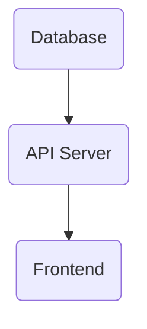
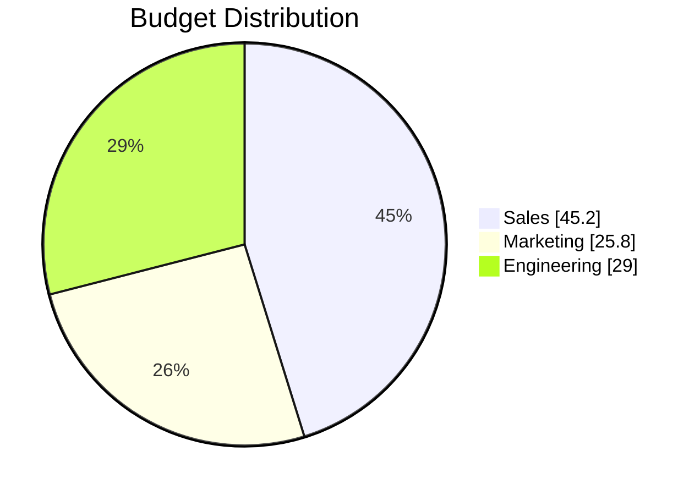
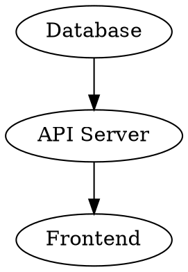

# Output Formats

The go-output library supports multiple output formats, each with specific features and use cases. This guide covers all supported formats and their configurations.

## Structured Data Formats

### JSON

Outputs data as JSON with preserved data types.

**Usage:**
```go
settings.SetOutputFormat("json")
```

**Features:**
- Preserves original data types (numbers, booleans, arrays, objects)
- Uses Go's `json.Marshal()` for consistent formatting
- Suitable for API responses and data interchange

**Example Output:**
```json
[
  {
    "Name": "Alice",
    "Age": 30,
    "Active": true,
    "Tags": ["admin", "user"]
  },
  {
    "Name": "Bob",
    "Age": 25,
    "Active": false,
    "Tags": ["user"]
  }
]
```

### YAML

Outputs data as YAML format.

**Usage:**
```go
settings.SetOutputFormat("yaml")
```

**Features:**
- Human-readable format
- Preserves data types
- Good for configuration files and documentation
- Uses `gopkg.in/yaml.v3` for formatting

**Example Output:**
```yaml
- Name: Alice
  Age: 30
  Active: true
  Tags:
    - admin
    - user
- Name: Bob
  Age: 25
  Active: false
  Tags:
    - user
```

### CSV

Outputs data as comma-separated values.

**Usage:**
```go
settings.SetOutputFormat("csv")
```

**Features:**
- Compatible with Excel and other spreadsheet applications
- All values converted to strings
- Headers automatically included
- Uses the go-pretty library for consistent formatting

**Example Output:**
```csv
Name,Age,Active,Tags
Alice,30,true,"admin, user"
Bob,25,false,user
```

## Presentation Formats

### Table

Outputs formatted tables for terminal display.

**Usage:**
```go
settings.SetOutputFormat("table")
settings.TableStyle = format.TableStyles["ColoredBright"]
settings.TableMaxColumnWidth = 50
```

**Features:**
- Multiple table styles available
- Configurable column width limits
- Terminal-friendly formatting
- Color support when enabled

**Available Table Styles:**
- `Default`
- `Bold`
- `ColoredBright`
- `ColoredDark`
- `ColoredBlackOnBlueWhite`
- `ColoredBlackOnCyanWhite`
- `ColoredBlackOnGreenWhite`
- And many more...

**Example Output:**
```
┌───────┬─────┬────────┬────────────┐
│ NAME  │ AGE │ ACTIVE │ TAGS       │
├───────┼─────┼────────┼────────────┤
│ Alice │ 30  │ true   │ admin, user│
│ Bob   │ 25  │ false  │ user       │
└───────┴─────┴────────┴────────────┘
```

### HTML

Outputs responsive HTML tables with embedded CSS.

**Usage:**
```go
settings.SetOutputFormat("html")
settings.Title = "User Report"
settings.HasTOC = true  // Add table of contents
```

**Features:**
- Responsive design that works on mobile devices
- Embedded CSS styling
- Support for table of contents
- Can append to existing HTML files
- Professional appearance

**Configuration Options:**
- `HasTOC`: Add a table of contents
- `ShouldAppend`: Append to existing HTML file
- `Title`: Page title
- `FrontMatter`: Additional metadata

**Example Output:**
```html
<html>
<head>
    <title>User Report</title>
    <style>
    /* Responsive table CSS */
    .responstable { ... }
    </style>
</head>
<body>
    <h1>User Report</h1>
    <table class="responstable">
        <tr><th>Name</th><th>Age</th><th>Active</th></tr>
        <tr><td>Alice</td><td>30</td><td>true</td></tr>
        <tr><td>Bob</td><td>25</td><td>false</td></tr>
    </table>
</body>
</html>
```

### Markdown

Outputs Markdown tables suitable for documentation.

**Usage:**
```go
settings.SetOutputFormat("markdown")
settings.FrontMatter = map[string]string{
    "title": "User Data",
    "author": "System",
}
```

**Features:**
- GitHub-compatible Markdown tables
- Support for front matter
- Good for documentation and README files
- Can be converted to other formats

**Example Output:**
```markdown
---
title: User Data
author: System
---

| Name  | Age | Active |
|-------|-----|--------|
| Alice | 30  | true   |
| Bob   | 25  | false  |
```

## Diagram Formats

### Mermaid

Generates Mermaid diagrams for flowcharts, pie charts, and Gantt charts.

**Requirements:**
- Must set `FromToColumns` for flowcharts
- Must set `MermaidSettings` for specific chart types

#### Flowcharts

**Usage:**
```go
settings.SetOutputFormat("mermaid")
settings.AddFromToColumns("Source", "Target")
settings.MermaidSettings.ChartType = "flowchart"  // or leave empty for default
```

**Example Output:**


#### Pie Charts

**Usage:**
```go
settings.SetOutputFormat("mermaid")
settings.MermaidSettings.ChartType = "piechart"
settings.AddFromToColumns("Category", "Value")  // Value must be float64
```

**Example Data:**
```go
data := []format.OutputHolder{
    {Contents: map[string]interface{}{"Category": "Sales", "Value": 45.2}},
    {Contents: map[string]interface{}{"Category": "Marketing", "Value": 25.8}},
    {Contents: map[string]interface{}{"Category": "Engineering", "Value": 29.0}},
}
```

**Example Output:**


#### Gantt Charts

**Usage:**
```go
settings.SetOutputFormat("mermaid")
settings.MermaidSettings.ChartType = "ganttchart"
settings.MermaidSettings.GanttSettings = &mermaid.GanttSettings{
    LabelColumn:     "Task",
    StartDateColumn: "Start",
    DurationColumn:  "Duration",
    StatusColumn:    "Status",
}
```

**Example Output:**


```mermaid
gantt
    title Project Timeline
    dateFormat HH:mm:ss
    Task 1    :active, 09:00:00, 4h
    Task 2    :done, 13:00:00, 2h
```

### DOT (GraphViz)

Generates DOT notation for GraphViz rendering.

**Usage:**
```go
settings.SetOutputFormat("dot")
settings.AddFromToColumns("From", "To")
```

**Features:**
- Compatible with GraphViz tools
- Automatic node creation
- Directed graph generation
- Good for network diagrams and dependencies

**Example Output:**


### Draw.io (CSV Import)

Generates CSV files that can be imported into Draw.io/Diagrams.net.

**Usage:**
```go
settings.SetOutputFormat("drawio")
settings.DrawIOHeader = drawio.DefaultHeader()
settings.OutputFile = "diagram.csv"  // File output required
```

**Features:**
- Direct import into Draw.io
- Customizable node shapes and styles
- Support for AWS shapes
- Connection definitions
- Layout options

**Header Configuration:**
```go
header := drawio.NewHeader("%Name%", "%Type%", "Type")
header.SetLayout(drawio.LayoutVerticalFlow)
header.SetSpacing(60, 120, 50)

// Add connections
connection := drawio.NewConnection()
connection.From = "Parent"
connection.To = "Name"
header.AddConnection(connection)

settings.DrawIOHeader = header
```

## Format-Specific Settings

### Buffer vs Direct Output

Some formats support incremental building using an internal buffer:

- **Buffer Supported**: CSV, HTML, Table, Markdown, YAML, JSON
- **Direct Generation**: Mermaid, DOT, Draw.io

### File Output

All formats support file output:

```go
settings.OutputFile = "output.json"
settings.OutputFileFormat = "json"  // Optional: different format for file
```

### S3 Output

Direct upload to Amazon S3:

```go
settings.SetS3Bucket(s3Client, "my-bucket", "path/to/file")
```

### Multiple Outputs

Generate the same data in different formats:

```go
// Console output in table format
settings.SetOutputFormat("table")
output.Write()

// File output in JSON format
settings.OutputFile = "data.json"
settings.OutputFileFormat = "json"
output.Write()
```

## Choosing the Right Format

| Use Case | Recommended Format | Why |
|----------|-------------------|-----|
| API responses | JSON | Preserves data types, widely supported |
| Data export | CSV | Universal spreadsheet compatibility |
| Documentation | Markdown | Version control friendly, readable |
| Terminal display | Table | Optimized for console viewing |
| Web presentation | HTML | Rich styling, responsive design |
| Process flows | Mermaid (flowchart) | Clear visual representation |
| Project planning | Mermaid (gantt) | Timeline visualization |
| Data analysis | Mermaid (pie) | Proportion visualization |
| Network diagrams | DOT | Professional graph layouts |
| Technical diagrams | Draw.io | Advanced diagramming features |
