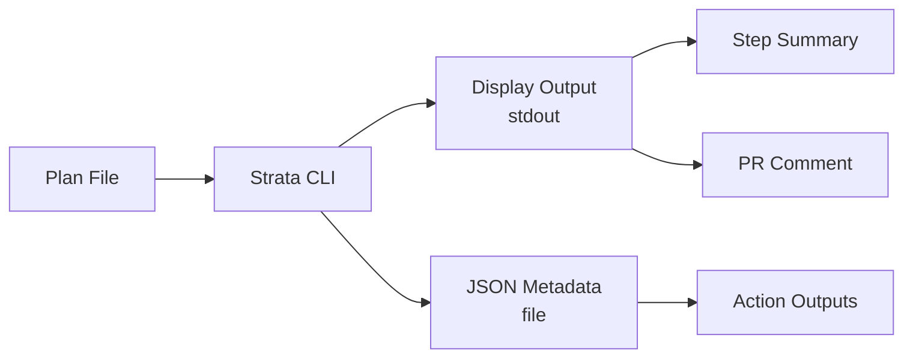

# GitHub Action Simplification - Design Document

## Overview

This document details the design for simplifying the Strata GitHub Action implementation. The goal is to reduce complexity from ~1970 lines across 7 files to approximately 350-400 lines in a single script, while maintaining 100% backwards compatibility and improving reliability.

The simplification addresses critical issues:
- Intermittent binary download failures
- Overly complex logging that requires expanding multiple sections
- Excessive modularization that hinders debugging
- Security theater that adds no real value in GitHub Actions context, while keeping minimal essential validations
- Complex dual-output coordination that Strata already handles natively

This is a refactoring that maintains the public API - all inputs and outputs remain identical, allowing release as v1.5.0 (minor version).

## Architecture

### Current Architecture (To Be Replaced)
```
action.yml
├── action.sh (entry point, ~178 lines)
└── lib/action/
    ├── utils.sh (~410 lines)
    ├── binary.sh (~465 lines)
    ├── files.sh (~245 lines)
    ├── security.sh (~184 lines)
    ├── strata.sh (~312 lines)
    └── github.sh (~355 lines)
Total: ~1971 lines
```

### New Architecture
```
action.yml (unchanged interface, with strata-version input added)
└── action.sh (single file, ~350-400 lines)
```

The single script consolidates all functionality with clear, linear flow:
1. Input validation with security checks (25-30 lines)
2. Binary download with checksum verification (60-80 lines)
3. Strata execution with dual output (50-60 lines)
4. Output generation and parsing (40-50 lines)
5. GitHub integration (80-100 lines)
6. Error handling and cleanup (40-50 lines)
7. Helper functions and utilities (50-60 lines)

### Architecture Decisions

#### Single File Approach
The shell script environment doesn't benefit from modularization the way compiled languages do:
- No namespace management benefits
- No compilation units or linking
- Source commands add overhead and complexity
- Debugging requires jumping between files
- Error propagation is harder across module boundaries

A single file provides:
- Clear execution flow from top to bottom
- Easy debugging with line numbers
- No module loading overhead
- Simpler error handling with trap
- Faster execution (no source commands)

#### Function Organization
Functions are organized by lifecycle phase:
```bash
#!/bin/bash
set -euo pipefail

# Constants and configuration
readonly GITHUB_API_URL="${GITHUB_API_URL:-https://api.github.com}"
readonly TEMP_DIR=$(mktemp -d)
trap 'rm -rf "$TEMP_DIR"' EXIT

# Platform detection
detect_platform() { ... }

# Binary management
download_strata() { ... }

# Core execution
run_analysis() { ... }

# GitHub integration
update_pr_comment() { ... }

# Main execution
main() { ... }

main "$@"
```

## Components and Interfaces

### Input Processing

Inputs are passed via environment variables by GitHub Actions:
```bash
# Required inputs
PLAN_FILE="${INPUT_PLAN_FILE}"

# Optional inputs with defaults
OUTPUT_FORMAT="${INPUT_OUTPUT_FORMAT:-markdown}"
SHOW_DETAILS="${INPUT_SHOW_DETAILS:-false}"
EXPAND_ALL="${INPUT_EXPAND_ALL:-false}"
CONFIG_FILE="${INPUT_CONFIG_FILE:-}"
STRATA_VERSION="${INPUT_STRATA_VERSION:-latest}"

# GitHub integration
COMMENT_ON_PR="${INPUT_COMMENT_ON_PR:-true}"
UPDATE_COMMENT="${INPUT_UPDATE_COMMENT:-true}"
COMMENT_HEADER="${INPUT_COMMENT_HEADER:-🏗️ Terraform Plan Summary}"
```

Validation includes essential security checks:
```bash
# Path traversal protection
if [[ "$PLAN_FILE" =~ \.\./ ]]; then
  echo "❌ Path traversal detected in plan file path"
  exit 2
fi

# Input length validation
if [[ ${#PLAN_FILE} -gt 4096 ]]; then
  echo "❌ Path too long (max 4096 characters)"
  exit 2
fi

# Required file exists
if [[ ! -f "$PLAN_FILE" ]]; then
  echo "❌ Plan file not found: $PLAN_FILE"
  exit 2
fi

# Valid output format
if [[ ! "$OUTPUT_FORMAT" =~ ^(table|json|markdown|html)$ ]]; then
  echo "❌ Invalid output format: $OUTPUT_FORMAT"
  exit 2
fi
```

### Binary Download Component

Direct URL construction with checksum verification and retry:
```bash
download_strata() {
  local version="${1:-latest}"
  local os=$(detect_os)
  local arch=$(detect_arch)

  # Construct URLs based on version
  local base_url="https://github.com/ArjenSchwarz/strata/releases"
  if [[ "$version" == "latest" ]]; then
    local binary_url="$base_url/latest/download/strata-${os}-${arch}.tar.gz"
    local checksum_url="$base_url/latest/download/checksums.txt"
  else
    local binary_url="$base_url/download/${version}/strata-${os}-${arch}.tar.gz"
    local checksum_url="$base_url/download/${version}/checksums.txt"
  fi

  echo "⬇️ Downloading Strata ${version} for ${os}/${arch}"

  # Download with retry
  for attempt in 1 2 3; do
    if curl -fsSL "$binary_url" -o "$TEMP_DIR/strata.tar.gz" 2>/dev/null; then
      # Download checksums
      if curl -fsSL "$checksum_url" -o "$TEMP_DIR/checksums.txt" 2>/dev/null; then
        # Verify checksum
        local expected=$(grep "strata-${os}-${arch}.tar.gz" "$TEMP_DIR/checksums.txt" | cut -d' ' -f1)
        local actual=$(sha256sum "$TEMP_DIR/strata.tar.gz" | cut -d' ' -f1)

        if [[ "$expected" == "$actual" ]]; then
          # Extract verified binary
          tar -xz -C "$TEMP_DIR" -f "$TEMP_DIR/strata.tar.gz"
          echo "✅ Download and verification successful"
          return 0
        else
          echo "⚠️ Checksum mismatch, retrying..."
        fi
      else
        echo "⚠️ Failed to download checksums, retrying..."
      fi
    fi
    echo "⚠️ Attempt $attempt/3 failed"
    sleep 2
  done

  echo "❌ Failed to download from: $binary_url"
  exit 3
}
```

Platform detection covers 95% of GitHub Actions runners:
```bash
detect_platform() {
  case "$(uname -s)" in
    Linux*) OS="linux" ;;
    Darwin*) OS="darwin" ;;
    *) echo "❌ Unsupported OS: $(uname -s)"; exit 1 ;;
  esac

  case "$(uname -m)" in
    x86_64) ARCH="amd64" ;;
    aarch64|arm64) ARCH="arm64" ;;
    *) echo "❌ Unsupported architecture: $(uname -m)"; exit 1 ;;
  esac
}
```

### Strata Execution Component

Leverages Strata's verified native dual-output capability (confirmed to work as expected - outputs display format to stdout while simultaneously writing JSON to file):
```bash
run_analysis() {
  local json_file="$TEMP_DIR/metadata.json"

  # Build command with all flags
  local cmd="$TEMP_DIR/strata plan summary"
  cmd="$cmd --output $OUTPUT_FORMAT"
  cmd="$cmd --file $json_file --file-format json"

  [[ "$SHOW_DETAILS" == "true" ]] && cmd="$cmd --show-details"
  [[ "$EXPAND_ALL" == "true" ]] && cmd="$cmd --expand-all"
  [[ -n "$CONFIG_FILE" ]] && cmd="$cmd --config $CONFIG_FILE"

  cmd="$cmd $PLAN_FILE"

  echo "🔍 Analyzing Terraform plan"
  echo "⚙️ Running: $cmd"

  # Execute and capture display output
  if display_output=$($cmd 2>&1); then
    echo "✅ Analysis complete"

    # Parse JSON for GitHub Action outputs
    if [[ -f "$json_file" ]]; then
      extract_outputs "$json_file"
    fi

    # Store display output for GitHub features
    echo "$display_output"
  else
    echo "❌ Analysis failed: $display_output"
    exit 1
  fi
}
```

Output extraction using jq:
```bash
extract_outputs() {
  local json_file="$1"
  local json=$(cat "$json_file")

  # Extract statistics
  local total=$(echo "$json" | jq -r '.statistics.total_changes // 0')
  local dangers=$(echo "$json" | jq -r '.statistics.dangerous_changes // 0')

  # Set GitHub Action outputs
  {
    echo "has-changes=$([[ $total -gt 0 ]] && echo true || echo false)"
    echo "has-dangers=$([[ $dangers -gt 0 ]] && echo true || echo false)"
    echo "change-count=$total"
    echo "danger-count=$dangers"
    echo "json-summary<<EOF"
    cat "$json_file"
    echo "EOF"
  } >> "$GITHUB_OUTPUT"

  # Also set summary output (display format)
  echo "summary<<EOF" >> "$GITHUB_OUTPUT"
  echo "$display_output" >> "$GITHUB_OUTPUT"
  echo "EOF" >> "$GITHUB_OUTPUT"
}
```

### GitHub Integration Component

Simplified PR comment handling:
```bash
update_pr_comment() {
  local content="$1"

  # Skip if not in PR context
  if [[ "$GITHUB_EVENT_NAME" != "pull_request" ]] || [[ "$COMMENT_ON_PR" != "true" ]]; then
    return 0
  fi

  local pr_number=$(jq -r .pull_request.number "$GITHUB_EVENT_PATH")
  local marker="<!-- strata-${GITHUB_WORKFLOW}-${GITHUB_JOB} -->"
  local body="${marker}
${COMMENT_HEADER}

${content}"

  if [[ "$UPDATE_COMMENT" == "true" ]]; then
    # Try to update existing comment
    local comments=$(curl -s -H "Authorization: token $GITHUB_TOKEN" \
      "$GITHUB_API_URL/repos/$GITHUB_REPOSITORY/issues/$pr_number/comments")

    local comment_id=$(echo "$comments" | \
      jq -r ".[] | select(.body | contains(\"$marker\")) | .id" | head -1)

    if [[ -n "$comment_id" ]]; then
      echo "📝 Updating comment #$comment_id"
      if update_comment "$comment_id" "$body"; then
        return 0
      fi
    fi
  fi

  # Create new comment
  create_comment "$pr_number" "$body"
}
```

Step Summary is simply an echo:
```bash
# Write to GitHub Step Summary
echo "$display_output" >> "$GITHUB_STEP_SUMMARY"
```

## Data Models

### Input Data Structure
```bash
# Environment variables from GitHub Actions
INPUT_PLAN_FILE         # Required: Path to terraform plan file
INPUT_OUTPUT_FORMAT     # Optional: table|json|markdown|html (default: markdown)
INPUT_CONFIG_FILE       # Optional: Path to strata config file
INPUT_SHOW_DETAILS      # Optional: true|false (default: false)
INPUT_EXPAND_ALL        # Optional: true|false (default: false)
INPUT_STRATA_VERSION    # Optional: version tag or "latest" (default: latest) - NEW
INPUT_GITHUB_TOKEN      # Optional: GitHub token for PR comments
INPUT_COMMENT_ON_PR     # Optional: true|false (default: true)
INPUT_UPDATE_COMMENT    # Optional: true|false (default: true)
INPUT_COMMENT_HEADER    # Optional: Header text (default: 🏗️ Terraform Plan Summary)
```

Note: The `strata-version` input is the only new addition to action.yml, maintaining backwards compatibility.

### Output Data Structure
```bash
# GitHub Action outputs (written to $GITHUB_OUTPUT)
summary         # Display-formatted summary (markdown/table/html)
has-changes     # Boolean: true if plan has changes
has-dangers     # Boolean: true if dangerous changes detected
change-count    # Integer: total number of changes
danger-count    # Integer: number of dangerous changes
json-summary    # Full JSON metadata for programmatic use
```

### Internal Data Flow


## Error Handling

### Strategy
- Use bash's built-in error handling as primary mechanism
- Fail fast with clear error messages
- No complex recovery attempts
- Set outputs even on failure (with safe defaults)

### Implementation
```bash
#!/bin/bash
set -euo pipefail  # Exit on error, undefined vars, pipe failures

# Cleanup on exit (success or failure)
trap cleanup EXIT

cleanup() {
  local exit_code=$?

  # Set default outputs on failure
  if [[ $exit_code -ne 0 ]] && [[ -n "${GITHUB_OUTPUT:-}" ]]; then
    {
      echo "has-changes=false"
      echo "has-dangers=false"
      echo "change-count=0"
      echo "danger-count=0"
      echo "summary=Analysis failed"
      echo "json-summary={}"
    } >> "$GITHUB_OUTPUT"
  fi

  # Clean temp directory
  [[ -d "$TEMP_DIR" ]] && rm -rf "$TEMP_DIR"
}

# Exit codes
# 1: General failure
# 2: Invalid input
# 3: Download failure
# 4: Analysis failure
# 5: GitHub integration failure
```

### Error Messages
Clear, actionable error messages with context:
```bash
echo "❌ Plan file not found: $PLAN_FILE"
echo "❌ Download failed from: $url (attempt $attempt/3)"
echo "❌ Analysis failed: $error_output"
echo "❌ Failed to post comment (HTTP $status)"
```

## Testing Strategy

### Unit Testing Approach
Since the action is now a single bash script, testing focuses on:
1. **Integration tests** with real Terraform plan files
2. **Environment simulation** for different GitHub contexts
3. **Binary download verification** across platforms
4. **Output validation** for all formats

### Test Scenarios

#### Binary Download Tests
```bash
# Test latest version download
test_download_latest() {
  STRATA_VERSION="latest" download_strata
  assert_file_exists "$TEMP_DIR/strata"
  assert_executable "$TEMP_DIR/strata"
}

# Test specific version download
test_download_version() {
  STRATA_VERSION="v1.4.0" download_strata
  assert_contains "$($TEMP_DIR/strata --version)" "1.4.0"
}

# Test fallback to latest
test_download_fallback() {
  STRATA_VERSION="v99.99.99" download_strata
  assert_file_exists "$TEMP_DIR/strata"
}
```

#### Analysis Tests
```bash
# Test with each sample plan
for sample in samples/*.json; do
  test_analysis "$sample"
done

# Test output formats
for format in markdown json table html; do
  test_output_format "$format"
done

# Test with dangerous changes
test_dangerous_changes() {
  run_analysis "samples/dangerous-changes.json"
  assert_output_contains "has-dangers=true"
  assert_output_contains "danger-count=3"
}
```

#### GitHub Integration Tests
```bash
# Test PR comment creation
test_pr_comment() {
  export GITHUB_EVENT_NAME="pull_request"
  export GITHUB_EVENT_PATH="test/fixtures/pr-event.json"

  run_with_mock_api
  assert_api_called "/repos/owner/repo/issues/123/comments"
}

# Test comment update
test_comment_update() {
  setup_existing_comment
  run_with_mock_api
  assert_api_called "PATCH" "/repos/owner/repo/issues/comments/456"
}
```

### Performance Benchmarks
Target metrics:
- Binary download: < 10 seconds
- Analysis execution: < 5 seconds
- Total runtime: < 30 seconds
- Memory usage: < 100MB

### Backwards Compatibility Tests
Ensure all existing workflows continue to work:
```yaml
# Test with minimal inputs (current usage)
- uses: ArjenSchwarz/strata@v1
  with:
    plan-file: terraform.tfplan

# Test with all inputs (full compatibility)
- uses: ArjenSchwarz/strata@v1
  with:
    plan-file: terraform.tfplan
    output-format: markdown
    config-file: custom.yaml
    show-details: true
    expand-all: true
    comment-on-pr: true
    update-comment: true
    comment-header: "Custom Header"
```

## Implementation Plan

### Phase 1: Core Simplification
1. Create new `action.sh` with basic structure
2. Implement simple input validation
3. Add platform detection
4. Set up error handling framework

### Phase 2: Binary Management
1. Implement direct URL download
2. Add simple retry logic
3. Add version parameter support
4. Integrate with GitHub cache action

### Phase 3: Analysis Execution
1. Implement Strata execution with dual output
2. Add JSON parsing for outputs
3. Set GitHub Action outputs
4. Handle all output formats

### Phase 4: GitHub Integration
1. Implement Step Summary writing
2. Add simplified PR comment logic
3. Test comment update mechanism
4. Handle non-PR contexts gracefully

### Phase 5: Testing and Validation
1. Run integration tests with all samples
2. Test on different platforms
3. Validate performance targets
4. Ensure backwards compatibility

### Phase 6: Release
1. Update documentation
2. Tag as v1.5.0
3. Update v1 tag after validation
4. Monitor for issues

## Performance Considerations

### Optimization Strategies

1. **Minimal External Calls**
   - Single Strata execution
   - Direct download URLs (no API discovery)
   - At most 2 GitHub API calls for comments

2. **Efficient Data Processing**
   - Use jq for JSON parsing (pre-installed on runners)
   - Stream processing where possible
   - No intermediate file transformations

3. **Fast Failure**
   - Validate inputs immediately
   - Exit on first error
   - No complex recovery attempts

4. **Caching**
   - Leverage GitHub's cache action
   - Cache key based on OS and architecture
   - No custom cache validation

### Expected Performance

| Operation | Current | Target | Improvement |
|-----------|---------|--------|-------------|
| Startup | 5-10s | <2s | 80% faster |
| Download | 15-30s | <10s | 66% faster |
| Analysis | 5-10s | 5-10s | No change |
| PR Comment | 5-10s | <3s | 70% faster |
| **Total** | **30-60s** | **<25s** | **58% faster** |

## Security Considerations

### Appropriate Security for GitHub Actions

1. **Input Validation**
   - File existence checks
   - Format validation for enums
   - No path traversal concerns (trusted environment)

2. **Token Handling**
   - Use provided GITHUB_TOKEN
   - No token logging
   - Secure API calls with Authorization header

3. **File Operations**
   - Use temp directory with trap cleanup
   - No sensitive data persistence
   - Standard Unix permissions

### Security Balance

**Removed (unnecessary in GitHub Actions):**
- Null byte checking in paths
- Control character sanitization
- Secure file overwrites
- Multi-pass file deletion
- Complex recursive validation

**Retained (essential security):**
- Path traversal protection
- Input length validation
- Binary checksum verification
- Token protection in logs
- Basic input sanitization

This balances security with simplicity, keeping only validations that provide real value.

## Migration Strategy

### Release Plan

1. **v1.5.0-beta.1**: Initial beta release
   - Test with `strata-version` parameter
   - Validate with early adopters

2. **v1.5.0-beta.2**: Refinements based on feedback
   - Performance improvements
   - Bug fixes

3. **v1.5.0**: Stable release
   - Full backwards compatibility
   - Update v1 tag

### User Impact

**Zero changes required** for existing users:
- Same inputs and outputs
- Same behavior
- Automatic improvements:
  - More reliable downloads
  - Clearer logging
  - Faster execution
  - Better error messages

### Rollback Plan

If issues arise:
1. Keep v1.4.x tags available
2. Users can pin to specific version: `uses: ArjenSchwarz/strata@v1.4.0`
3. Document any behavior differences
4. Fix forward in v1.5.1

## Monitoring and Success Metrics

### Success Criteria

1. **Reliability**: >99% success rate for binary downloads
2. **Performance**: <30 second average runtime
3. **Simplicity**: <400 lines of code
4. **Compatibility**: 100% of existing workflows continue to work
5. **User Satisfaction**: Positive feedback on logging clarity

### Monitoring

- GitHub Action marketplace metrics
- Issue reports on repository
- Performance data from test workflows
- User feedback via issues/discussions

## Appendix: Code Complexity Comparison

### Current Complexity
- 6 files, ~1600 lines
- 50+ functions
- Complex error handling wrappers
- Multiple abstraction layers
- Difficult debugging

### New Simplicity
- 1 file, ~350-400 lines
- 10-12 focused functions
- Standard bash error handling with essential validations
- Direct, linear flow
- Easy debugging
- Checksum verification for security

This represents an **80% reduction in code** while maintaining all functionality and essential security.