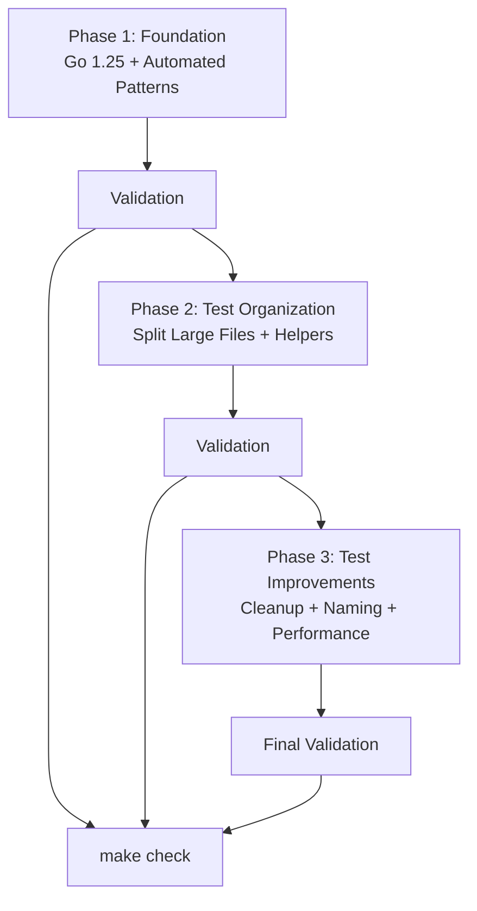

# Code Cleanup and Modernization - Design Document

## Overview

This document describes a practical, focused approach to modernizing the Strata codebase through Go 1.25.0 upgrade, automated pattern modernization, and targeted test improvements. The design emphasizes simplicity and leverages existing tooling to minimize risk and implementation time.

### Goals

1. **Upgrade to Go 1.25.0**: Access performance improvements, new standard library features (testing/synctest), and enhanced tooling
2. **Apply Modern Go Patterns**: Use automated tooling to adopt min/max functions, `any` type, and `slices` package functions
3. **Improve Test Maintainability**: Focus on high-impact improvements - splitting large test files, marking test helpers, and standardizing naming
4. **Maintain Stability**: Preserve all existing functionality while reducing technical debt
5. **Quick Implementation**: Complete modernization efficiently using standard tooling

### Scope

- **In Scope**: Go version upgrade, automated modernization patterns, test file organization, helper function marking, cleanup pattern migration, variable naming standardization
- **Out of Scope**: Custom tooling development, complex validation pipelines, architectural changes, external dependency upgrades beyond compatibility

## Architecture

### Simple, Practical Approach

This modernization follows a straightforward three-phase approach using standard Go tooling:



### Implementation Strategy

**Phase 1: Foundation (Day 1)**
- Upgrade to Go 1.25.0 
- Apply automated modernization using existing tools
- Minimal risk due to standard tooling and good test coverage

**Phase 2: Test Organization (Day 2)**  
- Split 3 large test files using existing `move_code_section.py` tool
- Mark test helpers with `t.Helper()`
- Focus on high-impact maintainability improvements

**Phase 3: Test Improvements (Day 3)**
- Migrate defer cleanup to `t.Cleanup()` patterns
- Standardize got/want variable naming 
- Add selective parallel testing where clearly beneficial
- Optional benchmark modernization

### Validation Strategy

Simple validation after each phase:
1. **Build Success**: `make build` - ensures compilation 
2. **Test Execution**: `make test` - validates functionality preservation
3. **Code Quality**: `make fmt && make vet && make lint` - maintains standards
4. **Action Compatibility**: `make test-action` - ensures GitHub Action works
5. **Race Detection**: `go test -race ./...` where parallel tests added

## Components and Tools

### 1. Standard Go Tooling

**Primary Tools**:
- **modernize**: Applies automated Go pattern modernization (`modernize -fix -test ./...`)
- **go mod**: Manages Go version and dependencies (`go mod edit -go=1.25.0`)
- **gofmt/goimports**: Handles code formatting and import management
- **Make targets**: Existing build validation (`make fmt`, `make test`, `make build`)

### 2. Existing Project Scripts

**Available Tools**:
- **move_code_section.py**: Safe code movement between files with proper Go package handling
- **Test organization**: Leverages existing script for test file splitting
- **Standard IDE refactoring**: For variable renaming and helper function identification

### 3. Test File Analysis

**Large Test Files to Split**:
- `config/validation_test.go`: 1,006 lines → Split by validation categories
- `lib/plan/analyzer_test.go`: 5,335 lines → Split by analysis functionality (resource changes, statistics, property analysis)
- `lib/plan/formatter_test.go`: 2,860 lines → Split by output format/feature (basic formatting, enhanced features, edge cases)

**Test Helper Functions to Mark** (Known examples):
- `testFormatterSortingBackwardCompatibility`
- `testPropertySortingBackwardCompatibility`
- Additional helpers identified through usage analysis

**Cleanup Patterns to Migrate**:
- `defer os.Remove()` → `t.Cleanup(func() { os.Remove(...) })`
- `defer os.RemoveAll()` → `t.Cleanup(func() { os.RemoveAll(...) })`
- Preserve cleanup order and error handling

### 4. Modernization Categories

**High-Value Patterns to Apply**:
- `minmax`: Replace if/else conditionals with min/max functions (4 known locations in analyzer.go)
- `efaceany`: Replace `interface{}` with `any` type
- `slicescontains`: Replace manual loops with `slices.Contains`
- `sortslice`: Replace `sort.Slice` with `slices.Sort`
- `rangeint`: Replace 3-clause for loops with range constructs
- `stringscutprefix`: Replace HasPrefix/TrimPrefix patterns with CutPrefix

## Data Models

### Simple Progress Tracking

No complex data structures needed. Progress tracked through:
- Git commits after each phase
- Console output from standard tools
- Standard `make` command exit codes for validation
- Simple documentation of changes made

## Error Handling

### Simple Error Recovery

**Git-Based Rollback**:
- Commit after each successful phase
- Use `git reset --hard HEAD~1` to rollback failed changes
- Work in feature branch to protect main development

**Common Issues & Solutions**:
- **Build Failures**: Revert to previous commit, investigate specific issue
- **Test Failures**: Check specific failing tests, may indicate real issues to address
- **Import Issues**: Run `goimports -w .` after transformations
- **Merge Conflicts**: Resolve manually - indicates concurrent changes in main

**Prevention Strategy**:
- Run `make test` after each major change
- Small, atomic commits allow precise rollback
- Standard tools minimize risk of creating broken code

## Testing Strategy

### Validation Approach

**Test Coverage**:
- Maintain existing coverage levels (70-80% target)
- Measure before and after changes using `go test -cover ./...`
- No need for complex coverage tracking - existing tests validate functionality

**Validation Commands**:
```bash
# Basic validation after each phase
make test           # Ensure all tests pass
make build          # Verify compilation
make test-action    # Validate GitHub Action compatibility
go test -race ./... # Check for race conditions (when parallel tests added)
```

**Test Improvements Focus**:
- **Helper Functions**: Add `t.Helper()` to improve debugging (known helpers: `testFormatterSortingBackwardCompatibility`, `testPropertySortingBackwardCompatibility`)
- **Cleanup Patterns**: Migrate `defer os.Remove*` to `t.Cleanup()` for guaranteed cleanup
- **Large File Splitting**: Organize tests by functionality for better maintainability
- **Naming Standards**: Use `got`/`want` and `tc` conventions for consistency

### Performance Considerations

**Parallel Testing** (Optional):
- Add `t.Parallel()` only to obviously safe unit tests
- Avoid tests with file operations, shared state, or ordering dependencies
- Measure execution time before/after to validate improvements

**Benchmark Compatibility**:
- Ensure existing benchmarks continue working
- Consider `b.Loop()` pattern for Go 1.25 where applicable
- No complex benchmark refactoring unless specific issues identified

## Implementation Plan

### Phase 1: Foundation (Day 1)

**Go Version Upgrade & Automated Modernization (2-3 hours)**
```bash
# Create feature branch
git checkout -b modernization

# Upgrade Go version
go mod edit -go=1.25.0
go mod tidy
make test  # Validate upgrade

# Apply automated modernization
modernize -fix -test ./...
gofmt -w .
goimports -w .
make test  # Validate modernization

# Commit changes
git add -A
git commit -m "modernize: Upgrade Go 1.25.0 + apply automated patterns"
```

### Phase 2: Test Organization (Day 2)

**Split Large Test Files & Mark Helpers (4-6 hours)**

**Split Large Files**:
1. `config/validation_test.go` (1,006 lines) → Split by validation categories
2. `lib/plan/analyzer_test.go` (5,335 lines) → Split into:
   - `analyzer_resource_test.go` (resource change analysis)
   - `analyzer_statistics_test.go` (statistics calculation)
   - `analyzer_properties_test.go` (property analysis)
3. `lib/plan/formatter_test.go` (2,860 lines) → Split into:
   - `formatter_basic_test.go` (basic formatting)
   - `formatter_enhanced_test.go` (enhanced features)
   - `formatter_edge_cases_test.go` (edge cases)

**Mark Test Helpers**:
- Add `t.Helper()` to known functions: `testFormatterSortingBackwardCompatibility`, `testPropertySortingBackwardCompatibility`
- Identify additional helpers through usage analysis
- Validate improved error reporting

```bash
make test  # Validate all tests still pass
git add -A
git commit -m "test: Split large files and mark helpers"
```

### Phase 3: Test Improvements (Day 3)

**Cleanup Migration & Naming Standards (3-4 hours)**

**Migrate Cleanup Patterns**:
- Find all `defer os.Remove*` patterns in test files
- Replace with `t.Cleanup(func() { os.Remove*(...) })` 
- Preserve cleanup order and error handling

**Standardize Variable Names**:
- Rename "expected" → "want"
- Rename "result"/"actual" → "got"  
- Use "tc" for test case variables
- Use IDE refactoring for safety

**Optional Parallel Testing**:
- Add `t.Parallel()` only to obviously safe unit tests
- Measure test execution time before/after

```bash
make test
go test -race ./... # If parallel tests added
git add -A
git commit -m "test: Migrate cleanup patterns and standardize naming"
```

### Final Validation (30 minutes)

```bash
make fmt      # Ensure formatting
make vet      # Static analysis  
make lint     # Code quality
make test     # All tests pass
make build    # Compilation success
make test-action  # GitHub Action compatibility

# Document test coverage
go test -cover ./...
```

**Total Effort**: ~3 days instead of 11 days
**Key Benefits**: All modernization goals achieved with minimal risk and complexity

## Success Metrics

### Completion Criteria

**Technical Deliverables**:
1. ✅ Go 1.25.0 upgrade complete with all tests passing
2. ✅ Automated modernization patterns applied (min/max, any, slices functions)
3. ✅ Large test files split into manageable pieces (<800 lines each)
4. ✅ Test helpers marked with `t.Helper()` for better debugging
5. ✅ Cleanup patterns migrated to `t.Cleanup()` where beneficial
6. ✅ Variable naming standardized (got/want conventions)

**Quality Gates**:
- All existing tests continue to pass
- Build and GitHub Action functionality preserved
- Test coverage maintained (70-80% target)
- Code formatting and linting standards met
- No new race conditions introduced

**Documentation**:
- Git commit messages clearly describe each change
- Any remaining improvements documented for future consideration
- Test execution time measured (before/after if parallel tests added)

This simplified design achieves all modernization goals through proven tools and practices, delivering maximum value with minimal risk and complexity.