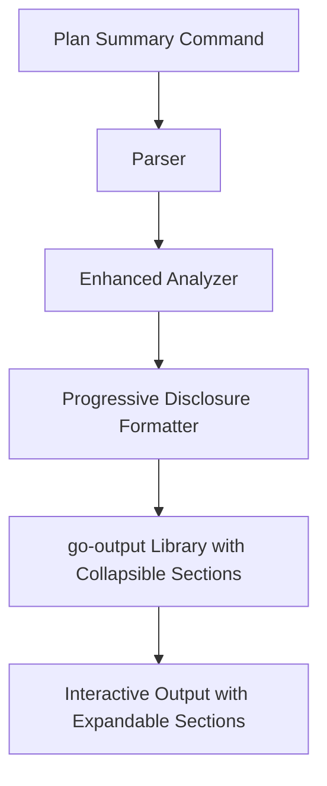

# Enhanced Summary Visualization Design with Collapsible Sections

## Overview

The Enhanced Summary Visualization feature leverages the new collapsible sections capability in go-output to provide progressive disclosure of Terraform plan information. This removes previous limitations around information density and enables comprehensive context display without cluttering the primary view. The implementation extends the existing plan analysis and formatting system while maintaining backward compatibility.

## Architecture

### Component Integration with Collapsible Sections



### Key Components

1. **Enhanced Analyzer** - Extends existing analyzer with comprehensive context extraction and risk analysis
2. **Progressive Disclosure Formatter** - Uses collapsible sections for all detailed information
3. **Leverages go-output Collapsible Sections** - Uses library's new expandable section capabilities for progressive disclosure
4. **Risk Mitigation Engine** - Generates detailed mitigation suggestions for risky changes

## Components and Interfaces

### 1. Enhanced Analyzer (extend existing `lib/plan/analyzer.go`)

Enhanced analyzer with comprehensive context extraction and risk analysis:

```go
// ResourceAnalysis contains analysis results for a single resource
// Note: This is a container for different analysis types, each handled by separate analyzers
type ResourceAnalysis struct {
    PropertyChanges     PropertyChangeAnalysis `json:"property_changes"`
    ReplacementReasons  []string              `json:"replacement_reasons"`
    RiskLevel          string                 `json:"risk_level"`      // Simple risk level for display
    Dependencies       DependencyInfo         `json:"dependencies"`
}

// PropertyChangeAnalysis focuses solely on property changes
type PropertyChangeAnalysis struct {
    Changes    []PropertyChange `json:"changes"`
    Count      int             `json:"count"`
    TotalSize  int             `json:"total_size_bytes"`
    Truncated  bool            `json:"truncated"` // True if hit limits
}

type PropertyChange struct {
    Name      string      `json:"name"`
    Path      []string    `json:"path"` // For nested properties
    Before    interface{} `json:"before"`
    After     interface{} `json:"after"`
    Sensitive bool        `json:"sensitive"`
    Size      int         `json:"size"` // Size in bytes for memory tracking
}

type RiskAssessment struct {
    Level                 string   `json:"level"`           // "low", "medium", "high", "critical"
    Score                 int      `json:"score"`           // 0-100 risk score
    ImpactAssessment     []string `json:"impact_assessment"`
    PotentialConsequences []string `json:"potential_consequences"`
    AutoExpand           bool     `json:"auto_expand"`
}

type DependencyInfo struct {
    DependsOn []string `json:"depends_on"`
    UsedBy    []string `json:"used_by"`
}

// AnalyzeResource performs analysis with performance limits
func (a *Analyzer) AnalyzeResource(change *tfjson.ResourceChange) (*ResourceAnalysis, error) {
    analysis := &ResourceAnalysis{}
    
    // Extract property changes with limits for performance
    propAnalysis, err := a.analyzePropertyChanges(change, a.config.MaxPropertiesPerResource)
    if err != nil {
        return nil, fmt.Errorf("failed to extract property changes: %w", err)
    }
    analysis.PropertyChanges = propAnalysis
    
    // Get replacement reasons (existing functionality)
    analysis.ReplacementReasons = a.extractReplacementReasons(change)
    
    // Perform simple risk assessment
    analysis.RiskLevel = a.assessRiskLevel(change)
    
    // Extract dependencies with limit
    // Note: The limit prevents infinite loops but proper cycle detection
    // should be implemented using a visited set during graph traversal
    deps, err := a.extractDependenciesWithLimit(change, 100)
    if err != nil {
        // Log but don't fail - dependencies are supplementary
        a.logger.Warn("dependency extraction failed", "error", err)
        deps = &DependencyInfo{}
    }
    analysis.Dependencies = deps
    
    return analysis, nil
}

// analyzePropertyChanges extracts property changes with performance safeguards
func (a *Analyzer) analyzePropertyChanges(change *tfjson.ResourceChange, maxProps int) (PropertyChangeAnalysis, error) {
    result := PropertyChangeAnalysis{
        Changes: []PropertyChange{},
    }
    
    if change.Change == nil {
        return result, nil
    }
    
    const maxTotalSize = 10 * 1024 * 1024 // 10MB limit
    
    // Use recursive comparison with depth limit
    err := a.compareValues(change.Change.Before, change.Change.After, nil, 0, 5, func(pc PropertyChange) bool {
        // Calculate approximate size
        pc.Size = a.estimateValueSize(pc.Before) + a.estimateValueSize(pc.After)
        result.TotalSize += pc.Size
        
        // Apply limits
        if result.Count >= maxProps || result.TotalSize > maxTotalSize {
            result.Truncated = true
            return false // Stop processing
        }
        
        result.Changes = append(result.Changes, pc)
        result.Count++
        return true
    })
    
    if err != nil {
        return result, fmt.Errorf("property comparison failed: %w", err)
    }
    
    return result, nil
}

// assessRiskLevel provides simplified risk assessment
func (a *Analyzer) assessRiskLevel(change *tfjson.ResourceChange) string {
    // Simple risk assessment based on change type and resource sensitivity
    if change.Change.Actions.Delete() {
        if a.isSensitiveResource(change) {
            return "critical"
        }
        return "high"
    }
    
    if change.Change.Actions.Replace() {
        if a.isSensitiveResource(change) {
            return "high"
        }
        return "medium"
    }
    
    if a.isSensitiveResource(change) && change.Change.Actions.Update() {
        return "medium"
    }
    
    return "low"
}
```

### 2. Progressive Disclosure Formatter (extend existing `lib/plan/formatter.go`)

Enhanced formatter leveraging go-output v2's collapsible content APIs:

```go
// formatResourceChangesWithProgressiveDisclosure uses go-output v2's collapsible features
func (f *Formatter) formatResourceChangesWithProgressiveDisclosure(summary *PlanSummary) (*output.Document, error) {
    builder := output.New()
    
    // Add summary header
    builder.Header("Terraform Plan Summary").
        Text(fmt.Sprintf("Total changes: %d resources", len(summary.ResourceChanges)))
    
    // Create table with collapsible formatters for detailed information
    tableData := f.prepareResourceTableData(summary.ResourceChanges)
    
    builder.Table("Resource Changes", tableData, output.WithSchema(
        output.Field{
            Name: "address",
            Type: "string",
            Formatter: output.FilePathFormatter(40), // Shorten long resource addresses
        },
        output.Field{
            Name: "change_type",
            Type: "string",
        },
        output.Field{
            Name: "risk_level",
            Type: "string",
            Formatter: f.riskLevelFormatter(), // Custom formatter with color hints
        },
        output.Field{
            Name: "property_changes",
            Type: "array",
            Formatter: f.propertyChangesFormatter(), // Collapsible property changes
        },
        output.Field{
            Name: "risk_analysis",
            Type: "object",
            Formatter: f.riskAnalysisFormatter(), // Collapsible risk details
        },
        output.Field{
            Name: "dependencies",
            Type: "object",
            Formatter: f.dependenciesFormatter(), // Collapsible dependency info
        },
    ))
    
    return builder.Build(), nil
}

// propertyChangesFormatter creates a collapsible formatter for property changes
func (f *Formatter) propertyChangesFormatter() func(any) any {
    return func(val any) any {
        if propAnalysis, ok := val.(PropertyChangeAnalysis); ok && propAnalysis.Count > 0 {
            // Create summary showing count and highlighting sensitive properties
            sensitiveCount := 0
            for _, change := range propAnalysis.Changes {
                if change.Sensitive {
                    sensitiveCount++
                }
            }
            
            summary := fmt.Sprintf("%d properties changed", propAnalysis.Count)
            if sensitiveCount > 0 {
                summary = fmt.Sprintf("⚠️ %d properties changed (%d sensitive)", propAnalysis.Count, sensitiveCount)
            }
            if propAnalysis.Truncated {
                summary += " [truncated]"
            }
            
            // Format details as structured data
            details := f.formatPropertyChangeDetails(propAnalysis.Changes)
            
            return output.NewCollapsibleValue(
                summary,
                details,
                output.WithExpanded(sensitiveCount > 0), // Auto-expand if sensitive
            )
        }
        return val
    }
}

// Note: Risk analysis is simplified to just a risk level string
// Future enhancement could add a collapsible risk details formatter

// formatGroupedWithCollapsibleSections uses go-output v2 collapsible sections
func (f *Formatter) formatGroupedWithCollapsibleSections(summary *PlanSummary, groups map[string][]ResourceChange) (*output.Document, error) {
    builder := output.New()
    
    builder.Header("Terraform Plan Summary by Provider")
    
    // Create collapsible sections for each provider
    for provider, resources := range groups {
        // Prepare table data for this provider's resources
        tableData := f.prepareResourceTableData(resources)
        
        // Create table content for the provider
        table, err := output.NewTableContent(
            fmt.Sprintf("%s Resources", strings.ToUpper(provider)),
            tableData,
            output.WithSchema(f.getResourceTableSchema()),
        )
        if err != nil {
            return nil, fmt.Errorf("failed to create table for provider %s: %w", provider, err)
        }
        
        // Determine if section should auto-expand based on risk
        autoExpand := f.hasHighRiskChanges(resources)
        
        // Create collapsible section for the provider
        section := output.NewCollapsibleTable(
            fmt.Sprintf("%s Provider (%d changes)", strings.ToUpper(provider), len(resources)),
            table,
            output.WithSectionExpanded(autoExpand),
        )
        
        // Note: The v2 API examples show Add() but it's not documented in the Builder interface
        // This needs clarification during implementation - may need to use Section() method instead
        builder.Add(section)
    }
    
    return builder.Build(), nil
}

// getResourceTableSchema returns the schema configuration for resource tables
func (f *Formatter) getResourceTableSchema() []output.Field {
    return []output.Field{
        {
            Name: "address",
            Type: "string",
            Formatter: output.FilePathFormatter(40),
        },
        {
            Name: "change_type",
            Type: "string",
        },
        {
            Name: "risk_level",
            Type: "string",
            // Simple string display, could add color formatting later
        },
        {
            Name: "property_changes",
            Type: "object",
            Formatter: f.propertyChangesFormatter(),
        },
        {
            Name: "dependencies",
            Type: "object",
            Formatter: f.dependenciesFormatter(),
        },
    }
}

// dependenciesFormatter creates a collapsible formatter for dependency information
func (f *Formatter) dependenciesFormatter() func(any) any {
    return func(val any) any {
        if deps, ok := val.(*DependencyInfo); ok && deps != nil {
            total := len(deps.DependsOn) + len(deps.UsedBy)
            if total == 0 {
                return "No dependencies"
            }
            
            summary := fmt.Sprintf("%d dependencies", total)
            
            var details []string
            if len(deps.DependsOn) > 0 {
                details = append(details, "Depends On:")
                for _, dep := range deps.DependsOn {
                    details = append(details, fmt.Sprintf("  - %s", dep))
                }
            }
            
            if len(deps.UsedBy) > 0 {
                if len(details) > 0 {
                    details = append(details, "")
                }
                details = append(details, "Used By:")
                for _, used := range deps.UsedBy {
                    details = append(details, fmt.Sprintf("  - %s", used))
                }
            }
            
            return output.NewCollapsibleValue(
                summary,
                details,
                output.WithExpanded(false), // Dependencies collapsed by default
            )
        }
        return val
    }
}

// formatPropertyChangeDetails formats property changes for collapsible display
func (f *Formatter) formatPropertyChangeDetails(changes []PropertyChange) []map[string]any {
    details := make([]map[string]any, 0, len(changes))
    for _, change := range changes {
        detail := map[string]any{
            "property": change.Name,
            "before":   change.Before,
            "after":    change.After,
        }
        if change.Sensitive {
            detail["sensitive"] = true
            // Mask sensitive values
            detail["before"] = "[sensitive value hidden]"
            detail["after"] = "[sensitive value hidden]"
        }
        details = append(details, detail)
    }
    return details
}
```

## Data Models

### Enhanced ResourceChange with go-output v2 Integration

```go
// Enhanced ResourceChange struct optimized for go-output v2 collapsible display
type ResourceChange struct {
    // ... existing fields ...
    
    // Enhanced fields for progressive disclosure
    Provider                   string                       `json:"provider,omitempty"`
    ComprehensiveAnalysis     *ComprehensiveChangeAnalysis `json:"comprehensive_analysis,omitempty"`
    SummaryView               string                       `json:"summary_view"`               // Brief description for main view
    RiskLevel                 string                       `json:"risk_level"`                 // "low", "medium", "high", "critical"
}

// prepareResourceTableData transforms ResourceChange data for go-output v2 table display
func (f *Formatter) prepareResourceTableData(changes []ResourceChange) []map[string]any {
    tableData := make([]map[string]any, 0, len(changes))
    
    for _, change := range changes {
        analysis, err := f.analyzer.AnalyzeResource(&change.Change)
        if err != nil {
            // Log error but continue with partial data
            f.logger.Warn("resource analysis failed", "resource", change.Address, "error", err)
            continue
        }
        
        row := map[string]any{
            "address":          change.Address,
            "change_type":      change.ChangeType,
            "risk_level":       analysis.RiskLevel,
            "property_changes": analysis.PropertyChanges,  // Will be formatted by collapsible formatter
            "dependencies":     &analysis.Dependencies,     // Will be formatted by collapsible formatter
        }
        
        // Add replacement reasons if applicable
        if len(analysis.ReplacementReasons) > 0 {
            row["replacement_reasons"] = analysis.ReplacementReasons
        }
        
        tableData = append(tableData, row)
    }
    
    return tableData
}

// Enhanced PlanConfig for progressive disclosure with go-output v2
type PlanConfig struct {
    // ... existing fields ...
    
    // Expandable sections configuration
    ExpandableSections ExpandableSectionsConfig `mapstructure:"expandable_sections"`
    
    // Grouping configuration (enhanced)
    Grouping GroupingConfig `mapstructure:"grouping"`
    
    // Output configuration for go-output v2
    OutputConfig OutputConfig `mapstructure:"output"`
}

type ExpandableSectionsConfig struct {
    Enabled             bool `mapstructure:"enabled"`                // Enable collapsible sections
    AutoExpandDangerous bool `mapstructure:"auto_expand_dangerous"`  // Auto-expand high-risk sections
    ShowDependencies    bool `mapstructure:"show_dependencies"`      // Show dependency sections
}

type GroupingConfig struct {
    Enabled   bool `mapstructure:"enabled"`   // Enable provider grouping
    Threshold int  `mapstructure:"threshold"` // Minimum resources to trigger grouping
}

type OutputConfig struct {
    CollapsibleConfig CollapsibleDisplayConfig `mapstructure:"collapsible"`
}

type CollapsibleDisplayConfig struct {
    MaxDetailLength      int    `mapstructure:"max_detail_length"`      // Character limit for details (default: 500)
    TruncateIndicator    string `mapstructure:"truncate_indicator"`     // Default: "[...truncated]"
    TableHiddenIndicator string `mapstructure:"table_hidden_indicator"` // Default: "[expand for details]"
}
```

### Enhanced Configuration

```yaml
# Global expand control
expand_all: false                    # Expand all collapsible sections

plan:
  expandable_sections:
    enabled: true                    # Enable collapsible sections
    auto_expand_dangerous: true      # Auto-expand high-risk sections
    show_dependencies: true          # Show dependency information
  grouping:
    enabled: true                    # Enable provider grouping
    threshold: 10                    # Minimum resources to trigger grouping
  output:
    collapsible:
      max_detail_length: 500         # Limit detail length to 500 chars
      truncate_indicator: "... [see full details]"
      table_hidden_indicator: "[click to expand]"
```

### Integration with go-output v2 Output System

```go
// createOutputWithConfig creates go-output v2 Output with collapsible configuration
func (f *Formatter) createOutputWithConfig(format output.Format) *output.Output {
    config := output.CollapsibleConfig{
        MaxDetailLength:      f.config.Plan.OutputConfig.CollapsibleConfig.MaxDetailLength,
        TruncateIndicator:    f.config.Plan.OutputConfig.CollapsibleConfig.TruncateIndicator,
        TableHiddenIndicator: f.config.Plan.OutputConfig.CollapsibleConfig.TableHiddenIndicator,
        GlobalExpansion:      f.config.ExpandAll, // Apply global expand-all setting
    }
    
    // Set defaults if not configured
    if config.MaxDetailLength == 0 {
        config.MaxDetailLength = 500
    }
    if config.TruncateIndicator == "" {
        config.TruncateIndicator = "[...truncated]"
    }
    if config.TableHiddenIndicator == "" {
        config.TableHiddenIndicator = "[expand for details]"
    }
    
    return output.NewOutput(
        output.WithFormat(format),
        output.WithWriter(output.NewStdoutWriter()),
        output.WithCollapsibleConfig(config),
    )
}

// RootConfig represents the top-level configuration
type RootConfig struct {
    ExpandAll bool       `mapstructure:"expand_all"` // Global expand all flag
    Plan      PlanConfig `mapstructure:"plan"`
    // ... other sections ...
}
```

## Error Handling

1. **Graceful Degradation**: If grouping fails, fall back to ungrouped display
2. **Context Extraction Errors**: Log warnings but continue with available data
3. **Invalid Configuration**: Use sensible defaults when config is missing
4. **Property Comparison Errors**: Skip properties that cannot be compared
5. **Memory Limits**: Stop processing when memory thresholds are reached
6. **Circular Dependencies**: Detect and break circular dependency chains

## Performance and Scalability

### Resource Limits

```go
type PerformanceLimits struct {
    MaxPropertiesPerResource int    // Default: 100
    MaxPropertySize         int     // Default: 1MB
    MaxTotalMemory         int64    // Default: 100MB
    MaxDependencyDepth     int      // Default: 10
    MaxResourcesPerGroup   int      // Default: 1000
}
```

### Performance Optimizations

1. **Property Extraction**:
   - Limit to 100 properties per resource by default
   - Skip properties larger than 1MB
   - Stop processing if total memory exceeds 100MB
   - Use depth-limited recursive comparison (max depth: 5)

2. **Risk Assessment Caching**:
   ```go
   type riskCache struct {
       mu    sync.RWMutex
       cache map[string]RiskAssessment
   }
   ```

3. **Parallel Processing**:
   ```go
   func (f *Formatter) processResourcesConcurrently(resources []ResourceChange) []ProcessedResource {
       sem := make(chan struct{}, runtime.NumCPU())
       results := make([]ProcessedResource, len(resources))
       var wg sync.WaitGroup
       
       for i, resource := range resources {
           wg.Add(1)
           sem <- struct{}{}
           go func(idx int, res ResourceChange) {
               defer wg.Done()
               defer func() { <-sem }()
               
               results[idx] = f.processResource(res)
           }(i, resource)
       }
       
       wg.Wait()
       return results
   }
   ```

### Benchmarks

Expected performance targets:
- 10 resources: < 100ms
- 100 resources: < 1s
- 1000 resources: < 10s
- Memory usage: O(n) with controlled growth

## Testing Strategy

### Unit Tests

1. **Grouper Tests** (`grouper_test.go`)
   - Test smart hierarchy logic
   - Test threshold behavior
   - Test provider/service extraction

2. **Context Extractor Tests** (`context_test.go`)
   - Test replacement reason extraction
   - Test property change detection
   - Test value comparison logic

3. **Formatter Tests** (`formatter_test.go`)
   - Test grouped output formatting
   - Test context display
   - Test risk highlighting

### Integration Tests

1. **End-to-End Tests**
   - Test complete flow with sample Terraform plans
   - Verify output formatting across all formats
   - Test configuration integration

2. **Edge Cases**
   - Empty plans
   - Single resource plans
   - Plans with only deletions
   - Plans with complex nested changes

### Test Data

Create test fixtures with various plan scenarios:
- `testdata/simple_plan.json` - Basic plan with few resources
- `testdata/complex_plan.json` - Plan with many resources requiring grouping
- `testdata/replacement_plan.json` - Plan with various replacement scenarios
- `testdata/sensitive_plan.json` - Plan with sensitive resource changes

## Implementation Notes

### go-output v2 Integration Patterns

#### Using Collapsible Formatters
```go
// Example: Creating custom formatters that return CollapsibleValue
func (f *Formatter) replacementReasonsFormatter() func(any) any {
    return func(val any) any {
        if reasons, ok := val.([]string); ok && len(reasons) > 0 {
            summary := fmt.Sprintf("Replacement required (%d reasons)", len(reasons))
            
            // Format reasons as bullet points
            var details []string
            for _, reason := range reasons {
                details = append(details, fmt.Sprintf("• %s", reason))
            }
            
            return output.NewCollapsibleValue(
                summary,
                details,
                output.WithExpanded(true), // Always expand replacement reasons
            )
        }
        return val
    }
}
```

#### Leveraging Built-in Formatters
```go
// Use go-output v2's built-in formatters for common patterns
schema := output.WithSchema(
    output.Field{
        Name: "resource_path",
        Type: "string",
        Formatter: output.FilePathFormatter(50), // Auto-collapse long paths
    },
    output.Field{
        Name: "validation_errors",
        Type: "array",
        Formatter: output.ErrorListFormatter(
            output.WithExpanded(false),
            output.WithMaxLength(300),
        ),
    },
    output.Field{
        Name: "state_changes",
        Type: "object",
        Formatter: output.JSONFormatter(200, output.WithExpanded(false)),
    },
)
```

### Simple Provider Extraction

Extract provider from resource type using string split:
- AWS: `aws_ec2_instance` → Provider: "aws"
- Azure: `azurerm_virtual_machine` → Provider: "azurerm"  
- Google: `google_compute_instance` → Provider: "google"

### Simplified Grouping Logic with v2 Sections

1. Check if resource count meets `grouping_threshold` (default: 10)
2. Skip grouping if all resources are from the same provider
3. If `group_by_provider` is enabled and conditions are met, group by provider
4. Use go-output v2's `NewCollapsibleTable` for provider sections

### Property Change Detection (Enhanced)

1. Compare all keys in before/after maps (no longer limited to 3)
2. Use existing `equals()` function from analyzer.go
3. Return ALL changed properties with CollapsibleValue formatting
4. Auto-expand when sensitive properties are changed

### Performance Optimizations

Based on efficiency review and v2 capabilities:
1. **Single-pass grouping**: O(n) complexity using map-based approach
2. **Provider extraction caching**: Cache results with sync.Map for thread safety
3. **Parallel resource processing**: Use worker pools for large plans
4. **Memory streaming**: v2's streaming renderers reduce memory usage
5. **Lazy evaluation**: Collapsible content loaded on-demand in supported formats

### Cross-Format Rendering Behavior

The collapsible content adapts automatically to each output format:

| Format   | Summary View | Expanded View | User Interaction |
|----------|--------------|---------------|------------------|
| Markdown | Shows summary | `<details>` elements | Click to expand |
| Table    | Shows summary + indicator | N/A in terminal | Use JSON/HTML for full details |
| JSON     | Full structured data | All data included | Programmatic access |
| HTML     | Shows summary | JavaScript expandable | Click to expand |
| CSV      | Summary column | Auto-generated detail columns | Filter/sort in spreadsheet |

## Migration Path

1. All new features are opt-in via configuration
2. Default behavior remains unchanged
3. Existing commands continue to work
4. New flags are additive, not breaking

## Simplified Implementation Plan

### Phase 1: Core Features (Initial Implementation)
1. Add 3 fields to ResourceChange model and 3 fields to PlanConfig
2. Implement smart provider grouping logic in analyzer (threshold + provider diversity check)
3. Add grouped display to formatter using go-output sections
4. Ensure replacement hints are always shown, context only when enabled

### Phase 2: Performance Optimizations
1. Add provider extraction caching
2. Implement parallel processing for large plans
3. Add memory streaming for output

### Future Enhancements (Deferred)
1. Service-level grouping within providers
2. Interactive mode with expand/collapse
3. Custom grouping rules
4. Advanced property change visualization

## Benefits of go-output v2 Integration

This enhanced design leveraging go-output v2's collapsible content APIs provides:

### User Experience Benefits
- **Eliminates information density constraints**: No longer limited to showing only 3 properties - all property changes accessible
- **Progressive disclosure built-in**: Users see summaries by default, expand for full details
- **Context-aware auto-expansion**: Critical risks and sensitive changes automatically expanded
- **Cross-format consistency**: Collapsible behavior adapts appropriately to each output format

### Technical Benefits
- **Simplified implementation**: Use v2's built-in formatters instead of custom truncation logic
- **Reduced code complexity**: CollapsibleValue handles expansion state and rendering
- **Better performance**: Lazy loading of details in supported formats reduces initial render time
- **Type-safe formatters**: Field formatters with proper type hints and validation

### Workflow Benefits
- **Quick scanning**: Summary views enable rapid assessment of changes
- **Deep analysis**: Full details available on-demand without switching tools
- **Flexible configuration**: Control expansion behavior globally or per-field
- **Format-appropriate output**: Each format (Markdown, JSON, Table, etc.) renders optimally

### Maintenance Benefits
- **Future-proof**: Built on v2's stable API with proper versioning
- **Extensible**: Easy to add new collapsible formatters for custom types
- **Testable**: Clear separation between data transformation and rendering
- **Documented patterns**: Follow v2's established patterns for consistency

## Key Improvements with v2 Integration

1. **Native Collapsible Support**: Leverage v2's CollapsibleValue and CollapsibleSection APIs instead of custom implementations
2. **Built-in Formatters**: Use ErrorListFormatter, FilePathFormatter, JSONFormatter for common patterns
3. **Unified Document Model**: Single Document object with proper content hierarchy
4. **Cross-Format Rendering**: Automatic adaptation to Markdown, JSON, Table, HTML, CSV formats
5. **Performance Optimizations**: Streaming renderers and lazy evaluation built into v2
6. **Configuration Management**: Centralized CollapsibleConfig for consistent behavior

### Migration from Original Design

The original design concepts remain valid but are now implemented using v2's native capabilities:
- **Property changes**: Now use CollapsibleValue formatters instead of custom sections
- **Risk analysis**: Integrated as table fields with collapsible formatters
- **Provider grouping**: Use NewCollapsibleTable for section-level grouping
- **Dependency info**: Field-level collapsible formatter shows relationships

This approach transforms the feature into a comprehensive Terraform plan analysis platform leveraging go-output v2's powerful progressive disclosure capabilities.

## Implementation Clarifications

### API Usage Notes

1. **CollapsibleSection Integration**: The v2 examples show `builder.Add()` being used with CollapsibleSection objects, but this method is not documented in the Builder interface. During implementation, we may need to:
   - Verify the actual API availability
   - Use alternative approaches like the `Section()` method if `Add()` is not available
   - Adapt the design based on the actual v2 implementation

2. **Risk Scoring Justification**: The risk scores (30 for delete, 50 for replace) are initial values that should be:
   - Configurable via strata.yaml
   - Adjusted based on user feedback
   - Potentially tied to resource-specific risk profiles

3. **Performance Targets**: The stated targets (100ms for 10 resources, etc.) are goals based on reasonable user expectations. Actual targets will be:
   - Measured against current implementation baseline
   - Adjusted based on profiling results
   - Used as optimization guides, not hard requirements

4. **Memory Tracking Implementation**: The `estimateValueSize()` function will use:
   - `unsafe.Sizeof()` for basic types
   - JSON marshaling for complex objects to get byte size
   - Approximate calculations for nested structures

5. **Provider Extraction Enhancement**: Beyond simple string splitting, the implementation will:
   - Support custom provider patterns via configuration
   - Handle edge cases with regex patterns
   - Fall back to "unknown" provider for unrecognized patterns

### Simplified Design Considerations

To address complexity concerns:

1. **Phased Implementation**: 
   - Phase 1: Basic collapsible properties and dependencies
   - Phase 2: Risk assessment with configurable scores
   - Phase 3: Provider grouping with collapsible sections

2. **Formatter Abstraction**: Create a generic collapsible formatter factory to reduce code duplication:
   ```go
   func createCollapsibleFormatter(summaryFn, detailsFn func(any) (string, any)) func(any) any
   ```

3. **Backward Compatibility**: All new features are opt-in via configuration, existing behavior unchanged when disabled

## API Clarification

### go-output v2 Collapsible APIs

Based on the v2 API documentation, the following features are available:

1. **CollapsibleValue Creation**:
   - `output.NewCollapsibleValue(summary, details, opts...)` - Creates expandable table cell content
   - Built-in formatters: `ErrorListFormatter()`, `FilePathFormatter()`, `JSONFormatter()`

2. **CollapsibleSection Creation**:
   - `output.NewCollapsibleTable(title, tableContent, opts...)` - Creates collapsible table section
   - `output.NewCollapsibleReport(title, []Content, opts...)` - Creates multi-content section
   - `output.WithSectionExpanded(bool)` - Controls default expansion state

3. **Output Configuration**:
   - `output.WithCollapsibleConfig(config)` - Configures collapsible behavior

## Complete Integration Example

Here's how the enhanced summary visualization works end-to-end with go-output v2:

```go
// Command implementation using v2
func (c *PlanSummaryCmd) Run() error {
    // Parse Terraform plan
    plan, err := c.parsePlan()
    if err != nil {
        return err
    }
    
    // Apply CLI flag override for expand-all
    if c.expandAllFlag {
        c.config.ExpandAll = true
    }
    
    // Create formatter with configuration
    formatter := NewFormatter(c.config)
    
    // Analyze and create summary
    summary := formatter.analyzer.Analyze(plan)
    
    // Build document based on configuration
    var doc *output.Document
    if c.config.Plan.Grouping.Enabled && len(summary.ResourceChanges) >= c.config.Plan.Grouping.Threshold {
        // Group by provider with collapsible sections
        groups := formatter.groupByProvider(summary.ResourceChanges)
        doc, err = formatter.formatGroupedWithCollapsibleSections(summary, groups)
    } else {
        // Standard display with collapsible details
        doc, err = formatter.formatResourceChangesWithProgressiveDisclosure(summary)
    }
    
    if err != nil {
        return fmt.Errorf("failed to format summary: %w", err)
    }
    
    // Create output with format-specific configuration
    format := formatter.getOutputFormat()
    out := formatter.createOutputWithConfig(format)
    
    // Render to stdout
    return out.Render(context.Background(), doc)
}

// Root command flag definition
func init() {
    rootCmd.PersistentFlags().BoolP("expand-all", "e", false, "Expand all collapsible sections")
}
```

### Example Output (Markdown Format)

```markdown
# Terraform Plan Summary

Total changes: 15 resources

| Address | Change Type | Risk Level | Property Changes | Risk Analysis | Dependencies |
|---------|-------------|------------|------------------|---------------|--------------|
| aws_rds_db_instance.main | replace | critical | <details><summary>⚠️ 5 properties changed (2 sensitive)</summary>• engine_version: 5.7 → 8.0<br/>• instance_class: db.t3.micro → db.t3.small<br/>• [sensitive values hidden]</details> | <details open><summary>Risk: CRITICAL</summary>Impact Assessment:<br/>• Database will be destroyed and recreated<br/>• Potential data loss if backups not current<br/><br/>Recommended Mitigations:<br/>• Create manual backup before applying<br/>• Consider blue-green deployment<br/>• Test in staging environment first</details> | 3 dependencies |
| aws_security_group.web | update | low | <details><summary>2 properties changed</summary>• ingress.0.cidr_blocks: ["10.0.0.0/8"] → ["10.0.0.0/8", "172.16.0.0/12"]<br/>• tags.Environment: staging → production</details> | Risk: low | No dependencies |
```

### Example Configuration for CI/CD

```yaml
# strata.yaml for GitHub Actions
expand_all: false                  # Can be overridden by --expand-all flag

plan:
  expandable_sections:
    enabled: true
    auto_expand_dangerous: true    # Always show critical risks in PR comments
    show_dependencies: true        # Show dependencies when available
  grouping:
    enabled: true
    threshold: 20                 # Group when many resources
  output:
    collapsible:
      max_detail_length: 300      # Limit for GitHub comment size
      table_hidden_indicator: "[expand]"
```

### GitHub Action Integration

The feature automatically detects when running in GitHub Actions and:
1. Uses Markdown format with GitHub-compatible `<details>` elements
2. Respects the `--expand-all` flag if passed to the action
3. Auto-expands dangerous changes for visibility in PR reviews
4. Works seamlessly with existing GitHub Action workflows

Example GitHub Action usage:
```yaml
- name: Run Terraform Plan Summary
  uses: ArjenSchwarz/strata-action@v1
  with:
    plan-file: terraform.tfplan
    # Optional: expand all sections in PR comment
    extra-args: --expand-all
```