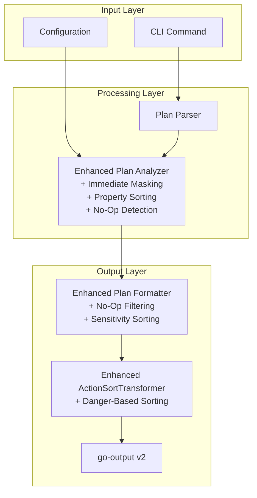

# Output Refinements Feature Design (Revised)

## Overview

The Output Refinements feature addresses critical usability improvements for Strata's Terraform plan summary output through targeted enhancements to existing components. This pragmatic design focuses on minimal code changes while achieving all requirements for sorting improvements, configurable no-op display, and sensitive value masking.

### Goals
- Restore predictable sorting behavior (sensitivity → action → alphabetical)
- Enable configurable no-op resource filtering
- Implement comprehensive sensitive value masking
- Sort property changes alphabetically within resources
- Hide no-op outputs by default

### Non-Goals
- Creating new architectural components
- Duplicating existing functionality
- Adding complex pipeline stages
- Over-engineering simple requirements

## Architecture

### Simplified Architecture



### Component Enhancement Strategy

1. **Enhanced Analyzer**: Add immediate sensitive value masking, property sorting, and no-op detection during analysis phase
2. **Enhanced Formatter**: Integrate no-op filtering and initial sorting during formatting
3. **Enhanced ActionSortTransformer**: Extend existing transformer to handle danger-based sorting
4. **Configuration**: Add minimal new configuration fields to existing structures

## Components and Interfaces

### 1. Configuration Enhancement

**Location**: `config/config.go` (minimal addition)

```go
// PlanConfig - Add single field to existing struct
type PlanConfig struct {
    // Existing fields remain unchanged...
    ShowNoOps bool `mapstructure:"show-no-ops"` // Show no-op resources (default: false)
}
```

**Implementation**: Simple boolean field addition, no new components needed.

### 2. Enhanced Analyzer

**Location**: `lib/plan/analyzer.go` (enhance existing functions)

```go
// Enhanced analyzePropertyChanges with immediate masking and sorting
func (a *Analyzer) analyzePropertyChanges(change *tfjson.ResourceChange) PropertyChangeAnalysis {
    analysis := PropertyChangeAnalysis{Changes: []PropertyChange{}}
    
    // Extract properties with immediate sensitive masking
    a.compareObjects("", change.Before, change.After, 
                     change.BeforeSensitive, change.AfterSensitive,
                     change.AfterUnknown, change.ReplacePaths, &analysis)
    
    // Sort properties alphabetically during analysis
    sort.Slice(analysis.Changes, func(i, j int) bool {
        // Case-insensitive alphabetical sorting
        if analysis.Changes[i].Name != analysis.Changes[j].Name {
            return strings.ToLower(analysis.Changes[i].Name) < 
                   strings.ToLower(analysis.Changes[j].Name)
        }
        // Secondary sort by path for same-named properties
        return strings.Join(analysis.Changes[i].Path, ".") < 
               strings.Join(analysis.Changes[j].Path, ".")
    })
    
    return analysis
}

// Enhanced compareObjects with immediate sensitive value masking
func (a *Analyzer) compareObjects(path string, before, after, 
                                  beforeSensitive, afterSensitive any, 
                                  afterUnknown any, replacePathStrings []string, 
                                  analysis *PropertyChangeAnalysis) {
    // Check if value is sensitive and mask immediately
    isSensitive := a.isValueSensitive(beforeSensitive, afterSensitive, path)
    
    if isSensitive {
        // Mask values immediately during extraction
        before = maskSensitiveValue(before)
        after = maskSensitiveValue(after)
    }
    
    // Continue with existing comparison logic...
}

// Helper function for immediate masking
func maskSensitiveValue(value any) any {
    if value == nil {
        return nil
    }
    // Return consistent mask while preserving type indication
    return "(sensitive value)"
}

// Add no-op detection to resource analysis
func (a *Analyzer) AnalyzePlan(plan *tfjson.Plan) (*PlanSummary, error) {
    // Existing analysis logic...
    
    for i, change := range summary.ResourceChanges {
        // Mark no-op resources for later filtering
        if change.ChangeType == ChangeTypeNoOp {
            summary.ResourceChanges[i].IsNoOp = true
        }
    }
    
    // Mark no-op outputs
    for i, output := range summary.OutputChanges {
        if reflect.DeepEqual(output.Before, output.After) {
            summary.OutputChanges[i].IsNoOp = true
        }
    }
    
    return summary, nil
}
```

### 3. Enhanced Formatter

**Location**: `lib/plan/formatter.go` (enhance existing functions)

```go
// Enhanced FormatPlan with integrated filtering
func (f *Formatter) FormatPlan(summary *PlanSummary) (string, error) {
    // Filter no-ops if configured
    if !f.config.Plan.ShowNoOps {
        summary.ResourceChanges = f.filterNoOps(summary.ResourceChanges)
        summary.OutputChanges = f.filterNoOpOutputs(summary.OutputChanges)
        
        // Handle empty results
        if len(summary.ResourceChanges) == 0 && len(summary.OutputChanges) == 0 {
            return "No changes detected", nil
        }
    }
    
    // Apply initial sorting before formatting
    summary.ResourceChanges = f.sortResourcesByPriority(summary.ResourceChanges)
    
    // Continue with existing formatting logic...
    return f.formatWithOutput(summary)
}

// Simple no-op filtering
func (f *Formatter) filterNoOps(resources []ResourceChange) []ResourceChange {
    filtered := make([]ResourceChange, 0, len(resources))
    for _, r := range resources {
        if r.ChangeType != ChangeTypeNoOp {
            filtered = append(filtered, r)
        }
    }
    return filtered
}

// Simple output filtering
func (f *Formatter) filterNoOpOutputs(outputs []OutputChange) []OutputChange {
    filtered := make([]OutputChange, 0, len(outputs))
    for _, o := range outputs {
        if !o.IsNoOp {
            filtered = append(filtered, o)
        }
    }
    return filtered
}

// Initial sorting by sensitivity and action
func (f *Formatter) sortResourcesByPriority(resources []ResourceChange) []ResourceChange {
    sort.Slice(resources, func(i, j int) bool {
        ri, rj := resources[i], resources[j]
        
        // First: Sort by danger/sensitivity
        if ri.IsDangerous != rj.IsDangerous {
            return ri.IsDangerous // Dangerous first
        }
        
        // Second: Sort by action priority
        actionPriority := map[ChangeType]int{
            ChangeTypeDelete:  0,
            ChangeTypeReplace: 1,
            ChangeTypeUpdate:  2,
            ChangeTypeCreate:  3,
            ChangeTypeNoOp:    4,
        }
        
        pi, pj := actionPriority[ri.ChangeType], actionPriority[rj.ChangeType]
        if pi != pj {
            return pi < pj
        }
        
        // Third: Alphabetical by address
        return ri.Address < rj.Address
    })
    
    return resources
}
```

### 4. Enhanced ActionSortTransformer

**Location**: `lib/plan/formatter.go` (enhance existing transformer)

```go
// Enhanced Transform to handle danger-based sorting
func (t *ActionSortTransformer) Transform(ctx context.Context, input []byte, format string) ([]byte, error) {
    content := string(input)
    
    // Check if this is a Resource Changes table
    if !strings.Contains(content, "Resource Changes") && 
       !strings.Contains(content, "Sensitive Resource Changes") {
        return input, nil
    }
    
    lines := strings.Split(content, "\n")
    // ... existing line parsing logic ...
    
    // Enhanced sorting with danger detection
    sort.Slice(sortedIndices, func(i, j int) bool {
        rowI, rowJ := dataRows[sortedIndices[i]], dataRows[sortedIndices[j]]
        
        // First: Check for danger indicators (existing logic enhanced)
        dangerI := t.hasDangerIndicator(rowI)
        dangerJ := t.hasDangerIndicator(rowJ)
        
        if dangerI != dangerJ {
            return dangerI // Dangerous rows first
        }
        
        // Second: Sort by action (existing logic)
        actionI := t.extractAction(rowI)
        actionJ := t.extractAction(rowJ)
        
        priorityI := t.getActionPriority(actionI)
        priorityJ := t.getActionPriority(actionJ)
        
        if priorityI != priorityJ {
            return priorityI < priorityJ
        }
        
        // Third: Alphabetical (existing logic)
        return rowI < rowJ
    })
    
    // ... rest of existing transformation logic ...
}

// Enhanced danger detection
func (t *ActionSortTransformer) hasDangerIndicator(row string) bool {
    // Check for danger column content
    if dangerColumnRegex.MatchString(row) {
        parts := strings.Split(row, "|")
        if len(parts) > 0 {
            lastCol := strings.TrimSpace(parts[len(parts)-1])
            return lastCol != "" && lastCol != "-"
        }
    }
    return false
}
```

## Data Models

### Minimal Model Extensions

```go
// ResourceChange - Add single field to existing struct
type ResourceChange struct {
    // All existing fields remain...
    IsNoOp bool `json:"-"` // Internal: true for no-op resources
}

// OutputChange - Add single field to existing struct
type OutputChange struct {
    // All existing fields remain...
    IsNoOp bool `json:"-"` // Internal: true if before equals after
}

// No new constants needed - use existing ChangeType values for priority
```

## Error Handling

### Graceful Degradation Strategy
- **Configuration errors**: Use safe defaults, continue operation
- **Sorting failures**: Return unsorted data rather than failing
- **Masking errors**: Mask entire value as "(sensitive)" if specific masking fails
- **Empty results**: Display user-friendly "No changes detected" message

## Testing Strategy

### Unit Tests

1. **Analyzer Enhancement Tests** (`lib/plan/analyzer_test.go`)
   - Test property alphabetical sorting
   - Test immediate sensitive value masking
   - Test no-op detection logic
   - Test case-insensitive sorting

2. **Formatter Enhancement Tests** (`lib/plan/formatter_test.go`)
   - Test no-op filtering with configuration
   - Test resource priority sorting
   - Test empty result handling
   - Test sorting with provider groups

3. **ActionSortTransformer Tests** (`lib/plan/formatter_test.go`)
   - Test danger-based sorting enhancement
   - Test action priority ordering
   - Test alphabetical fallback
   - Test regex pattern matching

### Integration Tests

1. **End-to-End Tests** (`test/integration/output_refinements_test.go`)
   - Test complete flow with all enhancements
   - Test with real Terraform plan files
   - Verify backward compatibility
   - Test configuration precedence

### Performance Validation

- Benchmark sorting with 1000+ resources
- Ensure <5% performance impact vs baseline
- Verify memory usage remains bounded

## Implementation Plan

### Phase 1: Configuration and Property Sorting (Day 1-2)
1. Add `ShowNoOps` field to PlanConfig
2. Enhance analyzer property sorting
3. Add immediate sensitive masking to compareObjects
4. Write unit tests for sorting

### Phase 2: No-Op Filtering (Day 2-3)
1. Add IsNoOp detection in analyzer
2. Implement filtering in formatter
3. Add CLI flag support
4. Handle empty results gracefully

### Phase 3: Enhanced Sorting (Day 3-4)
1. Add sortResourcesByPriority to formatter
2. Enhance ActionSortTransformer for danger detection
3. Test with provider grouping
4. Validate sorting precedence

### Phase 4: Integration and Testing (Day 4-5)
1. Integration testing with real plans
2. Performance benchmarking
3. Documentation updates
4. Edge case validation

## Decision Rationale

### Why Enhance Existing Components?
- **Minimal Disruption**: Leverages proven, working code
- **Reduced Risk**: No new integration points to debug
- **Faster Implementation**: Days instead of weeks
- **Maintainability**: Less code to maintain long-term

### Why Immediate Masking?
- **Security First**: No window where sensitive data exists unmasked
- **Single Pass**: More efficient than late-stage masking
- **Consistency**: All code paths get masked values

### Why Simple Filtering?
- **Straightforward Logic**: Boolean check is easy to understand
- **Performance**: No complex filtering pipeline needed
- **Predictable**: Clear when filtering happens

### Why Reuse ActionSortTransformer?
- **Already Works**: Existing transformer handles table sorting correctly
- **No Duplication**: Avoids redundant sorting logic
- **Proven Solution**: Has been tested in production

## Key Design Decisions

1. **Enhance, Don't Replace**: Work with existing components rather than creating new ones
2. **Security by Default**: Mask sensitive values immediately during extraction
3. **Progressive Enhancement**: Add features incrementally without breaking existing functionality
4. **Performance Focus**: Single-pass processing where possible
5. **Configuration Simplicity**: One new config field, clear precedence rules

## Dependencies

### External Dependencies (No Changes)
- `github.com/hashicorp/terraform-json` v0.25.0 - Existing
- `github.com/ArjenSchwarz/go-output` v2.1.0 - Existing
- `github.com/spf13/cobra` v1.9.1 - Existing
- `github.com/spf13/viper` v1.20.1 - Existing

### Internal Dependencies
- Enhance existing analyzer.go
- Enhance existing formatter.go
- Minor addition to config.go
- Minor addition to models.go

## Migration and Compatibility

### Complete Backward Compatibility
- Default behavior unchanged (no-ops shown)
- Sorting fix restores expected behavior
- All existing configurations work
- No breaking changes

### Configuration Addition
```yaml
# Single new optional field
plan:
  show-no-ops: false  # Optional, defaults to false
```

## Security Considerations

### Immediate Masking
- Sensitive values masked during property extraction
- No exposure window in pipeline
- Consistent masking across formats
- No sensitive data in logs

## Performance Considerations

### Minimal Impact
- Single-pass processing in analyzer
- One sort operation per resource list
- Existing ActionSortTransformer unchanged
- Expected <5% performance impact

## Summary

This revised design addresses all requirements through surgical enhancements to existing components rather than creating new architectural layers. The approach:

1. **Adds property sorting and immediate masking** to the existing analyzer
2. **Adds simple filtering and initial sorting** to the existing formatter  
3. **Enhances ActionSortTransformer** for danger-based sorting
4. **Adds one configuration field** for no-op control

This pragmatic approach delivers all required functionality with minimal code changes, reduced risk, and faster implementation timeline (5 days vs 3 weeks).