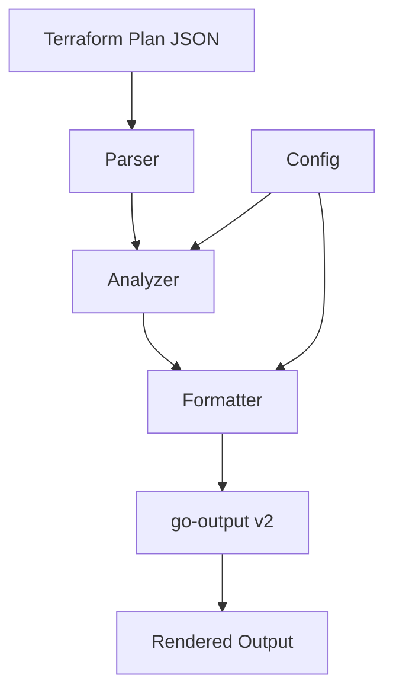

# Plan Summary Output Improvements - Design Document

## Overview

This feature enhances the plan summary output to provide cleaner, more readable, and more useful information to users. The improvements address several output quality issues:

1. Empty tables cluttering the output when no actual changes exist
2. Property changes displayed as single emojis instead of actual change details
3. Incorrect property change counting
4. Lack of risk-based sorting to prioritize dangerous changes

The solution involves enhancing the parser to extract detailed information from Terraform plan JSON through deep object comparison, improving the formatter to display property changes in Terraform's native diff format, implementing empty table suppression logic, and re-enabling the existing ActionSortTransformer which has been debugged according to the decision log.

## Architecture

### System Context

The plan summary output improvements integrate with the existing Strata architecture:



### Key Components

1. **Parser Enhancement**: Extract property-level changes from plan JSON
2. **Analyzer Updates**: Build proper PropertyChangeAnalysis structures
3. **Formatter Improvements**: Create custom CollapsibleFormatter for Terraform-style diff display
4. **Table Management**: Implement empty table suppression logic
5. **Sorting**: Re-enable ActionSortTransformer with fixes

## Components and Interfaces

### Parser Enhancements

The parser does not need enhancement for basic functionality. The Terraform plan JSON provides:
- `before` and `after` states as complete objects in the Change structure
- `before_sensitive` and `after_sensitive` for masking sensitive values

Property extraction will happen in the Analyzer through deep object comparison.

### Analyzer Updates

The analyzer will properly populate PropertyChangeAnalysis through deep object comparison:

```go
// Enhanced analyzer methods
func (a *Analyzer) analyzePropertyChanges(rc *tfjson.ResourceChange) PropertyChangeAnalysis {
    changes := PropertyChangeAnalysis{
        Changes: []PropertyChange{},
    }
    
    // Deep compare before and after states
    a.compareObjects("", rc.Change.Before, rc.Change.After, 
                    rc.Change.BeforeSensitive, rc.Change.AfterSensitive,
                    &changes)
    
    changes.Count = len(changes.Changes)
    return changes
}

// Deep object comparison algorithm
func (a *Analyzer) compareObjects(path string, before, after, beforeSens, afterSens any, 
                                 analysis *PropertyChangeAnalysis) {
    // Handle nil cases
    if before == nil && after == nil {
        return
    }
    
    // Property added
    if before == nil && after != nil {
        analysis.Changes = append(analysis.Changes, PropertyChange{
            Name:   extractPropertyName(path),
            Path:   parsePath(path),
            Before: nil,
            After:  after,
            Action: "add",
            Sensitive: isSensitive(path, afterSens),
        })
        return
    }
    
    // Property removed
    if before != nil && after == nil {
        analysis.Changes = append(analysis.Changes, PropertyChange{
            Name:   extractPropertyName(path),
            Path:   parsePath(path),
            Before: before,
            After:  nil,
            Action: "remove",
            Sensitive: isSensitive(path, beforeSens),
        })
        return
    }
    
    // Type checking and recursive comparison
    beforeType := reflect.TypeOf(before)
    afterType := reflect.TypeOf(after)
    
    // Type changed
    if beforeType != afterType {
        analysis.Changes = append(analysis.Changes, PropertyChange{
            Name:   extractPropertyName(path),
            Path:   parsePath(path),
            Before: before,
            After:  after,
            Action: "update",
            Sensitive: isSensitive(path, beforeSens) || isSensitive(path, afterSens),
        })
        return
    }
    
    // Compare based on type
    switch beforeVal := before.(type) {
    case map[string]any:
        afterMap := after.(map[string]any)
        // Compare all keys in both maps
        allKeys := make(map[string]bool)
        for k := range beforeVal {
            allKeys[k] = true
        }
        for k := range afterMap {
            allKeys[k] = true
        }
        
        for key := range allKeys {
            newPath := path + "." + key
            if path == "" {
                newPath = key
            }
            beforeChild := beforeVal[key]
            afterChild := afterMap[key]
            beforeSensChild := extractSensitiveChild(beforeSens, key)
            afterSensChild := extractSensitiveChild(afterSens, key)
            
            a.compareObjects(newPath, beforeChild, afterChild, 
                           beforeSensChild, afterSensChild, analysis)
        }
        
    case []any:
        afterSlice := after.([]any)
        // Handle slice changes - simplified for arrays of same length
        if len(beforeVal) != len(afterSlice) {
            // Entire array changed
            analysis.Changes = append(analysis.Changes, PropertyChange{
                Name:   extractPropertyName(path),
                Path:   parsePath(path),
                Before: before,
                After:  after,
                Action: "update",
                Sensitive: isSensitive(path, beforeSens) || isSensitive(path, afterSens),
            })
        } else {
            // Compare elements
            for i := 0; i < len(beforeVal); i++ {
                newPath := fmt.Sprintf("%s[%d]", path, i)
                a.compareObjects(newPath, beforeVal[i], afterSlice[i],
                               extractSensitiveIndex(beforeSens, i),
                               extractSensitiveIndex(afterSens, i), analysis)
            }
        }
        
    default:
        // Primitive values - direct comparison
        if !reflect.DeepEqual(before, after) {
            analysis.Changes = append(analysis.Changes, PropertyChange{
                Name:   extractPropertyName(path),
                Path:   parsePath(path),
                Before: before,
                After:  after,
                Action: "update",
                Sensitive: isSensitive(path, beforeSens) || isSensitive(path, afterSens),
            })
        }
    }
}

```

### Formatter Improvements

#### Custom CollapsibleFormatter

A new formatter will display property changes in Terraform's native diff format:

```go
func (f *Formatter) propertyChangesFormatterTerraform() func(any) any {
    return func(val any) any {
        if propAnalysis, ok := val.(PropertyChangeAnalysis); ok {
            if propAnalysis.Count == 0 {
                return "No properties changed"
            }
            
            // Create summary
            summary := fmt.Sprintf("%d properties changed", propAnalysis.Count)
            if hasSensitive(propAnalysis.Changes) {
                summary = fmt.Sprintf("⚠️ %s (includes sensitive)", summary)
            }
            
            // Format details in Terraform style
            var details []string
            for _, change := range propAnalysis.Changes {
                line := f.formatPropertyChange(change)
                details = append(details, line)
            }
            
            shouldExpand := hasSensitive(propAnalysis.Changes) || 
                           f.config.ExpandAll
            
            return output.NewCollapsibleValue(summary, 
                strings.Join(details, "\n"), 
                output.WithExpanded(shouldExpand))
        }
        return val
    }
}

func (f *Formatter) formatPropertyChange(change PropertyChange) string {
    // Format based on action and handle complex values
    switch change.Action {
    case "add":
        return fmt.Sprintf("  + %s = %s", 
            change.Name, f.formatValue(change.After, change.Sensitive))
    case "remove":
        return fmt.Sprintf("  - %s = %s", 
            change.Name, f.formatValue(change.Before, change.Sensitive))
    case "update":
        return fmt.Sprintf("  ~ %s = %s -> %s", 
            change.Name, 
            f.formatValue(change.Before, change.Sensitive),
            f.formatValue(change.After, change.Sensitive))
    default:
        return ""
    }
}

func (f *Formatter) formatValue(val any, sensitive bool) string {
    if sensitive {
        return "(sensitive value hidden)"
    }
    
    // Handle different value types
    switch v := val.(type) {
    case string:
        return fmt.Sprintf("%q", v)
    case map[string]any:
        // Format as { key = value, ... } or <map[N]> for large maps
        if len(v) > 3 {
            return fmt.Sprintf("<map[%d]>", len(v))
        }
        // ... format small maps inline ...
    case []any:
        // Format as [ item, ... ] or <list[N]> for large lists
        if len(v) > 3 {
            return fmt.Sprintf("<list[%d]>", len(v))
        }
        // ... format small lists inline ...
    default:
        return fmt.Sprintf("%v", v)
    }
}
```

#### Empty Table Suppression

The formatter will check if tables would be empty after filtering:

```go
func (f *Formatter) prepareResourceTableData(changes []ResourceChange) []map[string]any {
    tableData := make([]map[string]any, 0, len(changes))
    
    for _, change := range changes {
        // Skip no-op changes from details (existing behavior)
        if change.ChangeType == ChangeTypeNoOp {
            continue
        }
        
        // ... prepare row data ...
        tableData = append(tableData, row)
    }
    
    return tableData
}

// In OutputSummary method:
func (f *Formatter) OutputSummary(summary *PlanSummary, outputConfig *config.OutputConfiguration, showDetails bool) error {
    // ... existing code ...
    
    if showDetails && len(summary.ResourceChanges) > 0 {
        // Filter out no-ops first
        tableData := f.prepareResourceTableData(summary.ResourceChanges)
        
        // Only create table if there's data after filtering
        if len(tableData) > 0 {
            // Create and add table
        }
        // If tableData is empty, table is suppressed automatically
    }
}

func (f *Formatter) countChangedResources(changes []ResourceChange) int {
    count := 0
    for _, change := range changes {
        if change.ChangeType != ChangeTypeNoOp {
            count++
        }
    }
    return count
}
```

#### Provider Grouping Updates

Provider grouping will use changed resource counts:

```go
func (f *Formatter) shouldGroupByProvider(changes []ResourceChange) bool {
    changedCount := f.countChangedResources(changes)
    return f.config.Plan.Grouping.Enabled && 
           changedCount >= f.config.Plan.Grouping.Threshold &&
           f.hasMultipleProviders(changes)
}

// When creating provider groups, filter no-ops
func (f *Formatter) groupResourcesByProvider(changes []ResourceChange) map[string][]ResourceChange {
    groups := make(map[string][]ResourceChange)
    for _, change := range changes {
        // Skip no-ops from grouping
        if change.ChangeType == ChangeTypeNoOp {
            continue
        }
        
        provider := change.Provider
        // ... existing provider extraction logic ...
        groups[provider] = append(groups[provider], change)
    }
    return groups
}
```

### ActionSortTransformer Pipeline Integration

The existing ActionSortTransformer has been debugged and fixed according to the decision log, but it's not currently in the rendering pipeline. The transformer should maintain its current format support:

```go
// Current implementation - keep as is
func (t *ActionSortTransformer) CanTransform(format string) bool {
    return format == output.Table.Name || format == output.Markdown.Name || 
           format == output.HTML.Name || format == output.CSV.Name
}
```

The issue is that the transformer is not being added to the output options. It needs to be added to the rendering pipeline:

```go
// In OutputSummary method, add the transformer
stdoutOptions := []output.OutputOption{
    output.WithFormat(stdoutFormat),
    output.WithWriter(output.NewStdoutWriter()),
}

// Add transformers to stdout based on configuration
if outputConfig.UseEmoji {
    stdoutOptions = append(stdoutOptions, output.WithTransformer(&output.EmojiTransformer{}))
}

// ADD THIS: Re-enable ActionSortTransformer in the pipeline
stdoutOptions = append(stdoutOptions, output.WithTransformer(&ActionSortTransformer{}))
```

**Note**: The transformer itself is working correctly for the supported formats, it just needs to be added back to the rendering pipeline.

## Data Models

### Enhanced PropertyChange Structure

```go
type PropertyChange struct {
    Name      string   `json:"name"`       // Property name only (no path)
    Path      []string `json:"path"`       // For nested properties
    Before    any      `json:"before"`     // Actual before value
    After     any      `json:"after"`      // Actual after value
    Sensitive bool     `json:"sensitive"`  // From sensitive_values
    Size      int      `json:"size"`       // For performance tracking
    Action    string   `json:"action"`     // "add", "remove", "update"
}
```


## Error Handling

### Parser Errors
- Handle missing or malformed change objects gracefully
- Default to empty PropertyChangeAnalysis if extraction fails
- Log warnings for unexpected plan JSON structure

### Formatter Errors
- Continue rendering if individual table creation fails
- Show placeholder text for missing data
- Ensure output is always produced

### Performance Limits

Performance limits are necessary to prevent excessive memory usage:

```go
const (
    MaxPropertiesPerResource = 100      // Prevent runaway property extraction
    MaxPropertyValueSize     = 10240    // 10KB per property value
    MaxTotalPropertyMemory   = 10485760 // 10MB total for all properties
)

// Enforce limits during property extraction
func (a *Analyzer) enforcePropertyLimits(analysis *PropertyChangeAnalysis) {
    if len(analysis.Changes) > MaxPropertiesPerResource {
        analysis.Changes = analysis.Changes[:MaxPropertiesPerResource]
        analysis.Truncated = true
    }
    
    totalSize := 0
    for i, change := range analysis.Changes {
        size := estimateSize(change)
        if totalSize + size > MaxTotalPropertyMemory {
            analysis.Changes = analysis.Changes[:i]
            analysis.Truncated = true
            break
        }
        totalSize += size
    }
    analysis.TotalSize = totalSize
}
```

**Rationale**: These limits prevent DoS scenarios with malicious or extremely large Terraform plans while still handling typical enterprise-scale infrastructure.

## Testing Strategy

### Unit Tests

1. **Property Comparison Tests** (`analyzer_test.go`)
   ```go
   func TestCompareObjects(t *testing.T) {
       tests := []struct {
           name     string
           before   any
           after    any
           expected []PropertyChange
       }{
           {
               name:   "simple string change",
               before: map[string]any{"name": "old"},
               after:  map[string]any{"name": "new"},
               expected: []PropertyChange{{
                   Name: "name", Action: "update", 
                   Before: "old", After: "new",
               }},
           },
           {
               name:   "nested object change",
               before: map[string]any{
                   "tags": map[string]any{"env": "dev"},
               },
               after: map[string]any{
                   "tags": map[string]any{"env": "prod"},
               },
               expected: []PropertyChange{{
                   Name: "env", Path: []string{"tags", "env"},
                   Action: "update", Before: "dev", After: "prod",
               }},
           },
           {
               name:   "array length change",
               before: map[string]any{"items": []any{1, 2}},
               after:  map[string]any{"items": []any{1, 2, 3}},
               expected: []PropertyChange{{
                   Name: "items", Action: "update",
                   Before: []any{1, 2}, After: []any{1, 2, 3},
               }},
           },
           {
               name:   "property removal",
               before: map[string]any{"a": 1, "b": 2},
               after:  map[string]any{"a": 1},
               expected: []PropertyChange{{
                   Name: "b", Action: "remove", Before: 2,
               }},
           },
           {
               name:   "sensitive value",
               before: map[string]any{"password": "old"},
               after:  map[string]any{"password": "new"},
               beforeSens: map[string]any{"password": true},
               expected: []PropertyChange{{
                   Name: "password", Action: "update",
                   Before: "old", After: "new", Sensitive: true,
               }},
           },
       }
   }
   ```

2. **Formatter Tests** (`formatter_test.go`)
   ```go
   func TestFormatPropertyChange(t *testing.T) {
       tests := []struct {
           change   PropertyChange
           expected string
       }{
           {
               change: PropertyChange{
                   Name: "instance_type", Action: "update",
                   Before: "t2.micro", After: "t2.small",
               },
               expected: `  ~ instance_type = "t2.micro" -> "t2.small"`,
           },
           {
               change: PropertyChange{
                   Name: "password", Action: "update", 
                   Sensitive: true,
               },
               expected: `  ~ password = (sensitive value hidden) -> (sensitive value hidden)`,
           },
       }
   }
   ```

3. **Empty Table Suppression Tests**
   ```go
   func TestEmptyTableSuppression(t *testing.T) {
       // Test with only no-op changes
       changes := []ResourceChange{
           {ChangeType: ChangeTypeNoOp},
           {ChangeType: ChangeTypeNoOp},
       }
       tableData := formatter.prepareResourceTableData(changes)
       assert.Empty(t, tableData, "Should return empty data for no-ops only")
   }
   ```

### Integration Tests

1. **End-to-End Tests**
   - Test with danger-sample.json to verify all improvements
   - Test with plans containing only no-op changes
   - Test sorting across different output formats

2. **Performance Tests**
   - Test with large plans (1000+ resources)
   - Test with resources having many property changes
   - Verify memory limits are respected

### Test Data

Use existing sample files:
- `samples/danger-sample.json` - Contains sensitive resources and replacements
- `samples/nochange-sample.json` - For testing empty table suppression
- Create new test files for complex property change scenarios

## Implementation Plan

### Code Cleanup Required
1. Remove `dependencies` field from `getResourceTableSchema()` in formatter.go
2. Remove `dependencies` row data from `prepareResourceTableData()` in formatter.go
3. Remove `dependenciesFormatterDirect()` function from formatter.go
4. Remove `DependencyInfo` struct from models.go (if not used elsewhere)
5. Remove any dependency-related code from analyzer.go

### Phase 1: Parser Enhancements
1. Implement property change extraction from before/after states
2. Update data flow to pass extracted data to analyzer

### Phase 2: Analyzer Updates
1. Replace placeholder PropertyChangeAnalysis with real data
2. Add performance limit checks

### Phase 3: Formatter Improvements
1. Implement Terraform diff format for property changes
2. Implement empty table suppression logic
3. Update provider grouping to use changed resource counts
4. Add ActionSortTransformer back to the rendering pipeline in OutputSummary
5. Remove dependencies column from resource table schema and data preparation

### Phase 4: Testing and Refinement
1. Add comprehensive unit tests
2. Add integration tests with sample files
3. Performance testing and optimization
4. Documentation updates

## Backward Compatibility

These changes modify the output format but maintain compatibility:

1. **Table Structure**: Column names and order remain the same
2. **JSON Output**: Structure unchanged, only values in property_changes field differ
3. **Sorting**: Improves readability without breaking existing parsers
4. **Empty Tables**: Were already confusing, suppression improves clarity

No configuration migration is needed as these are bug fixes, not new features.

## Technical Debt and Future Considerations

### Current Limitations
- Array comparison simplified (shows entire array changed for length differences)
- Complex nested structures may hit performance limits
- Property paths use simple dot notation (array indices shown as [n])

### Future Enhancements
- Implement sophisticated array diff algorithm
- Make performance limits configurable via config file
- Add caching for repeated property comparisons
- Support custom property formatters for provider-specific types

## Security Considerations

- Sensitive values must remain masked in output
- Property values from sensitive_values must be hidden
- No logging of sensitive data during processing
- Ensure memory limits prevent DoS from large plans

## Decision Rationale

1. **Terraform Diff Format**: Users are familiar with this format from terraform plan output
2. **Property-Level Changes**: Provides actionable information vs. generic emoji
3. **Empty Table Suppression**: Reduces visual clutter for better readability
4. **Risk-Based Sorting**: Ensures dangerous changes are immediately visible
5. **No Configuration**: These are bug fixes, not optional features