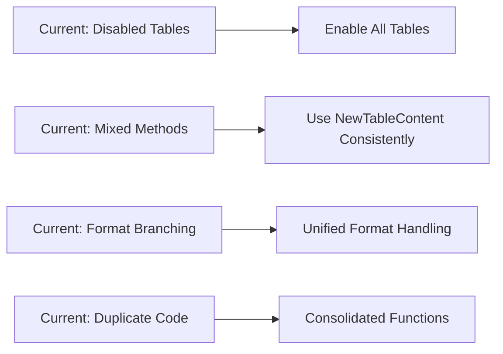

# Simplified Plan Rendering Design

## Overview

This design document outlines the targeted changes required to fix the multi-table rendering bug in markdown format and simplify Strata's plan rendering architecture. 

**Root Cause Analysis**: The multi-table rendering issue is NOT a fundamental architectural problem or go-output v2 library bug. The tables were deliberately disabled in the current implementation (lines 189-191 in formatter.go) with a TODO comment claiming a "go-output v2 multi-table rendering bug" that doesn't actually exist.

**Validation Evidence**: Testing with go-output v2's collapsible-tables example and a custom proof-of-concept confirms that multiple tables render correctly in markdown format when using `output.NewTableContent()` with the `output.New().AddContent().AddContent().Build()` pattern.

**Solution Approach**: Rather than a complete architectural overhaul, this is a targeted fix that adopts the proven `NewTableContent` pattern consistently while simplifying the existing format-specific complexity.

## Architecture

### Specific Issues Identified

1. **Disabled Tables**: Plan Information and Summary Statistics tables are commented out (lines 189-191) due to false assumption about library bug
2. **Mixed Table Creation**: Uses both `builder.Table()` and `output.NewTableContent()` inconsistently  
3. **Format Branching**: Complex format-specific logic creates maintenance burden
4. **Duplicate Functions**: Near-identical formatter functions increase code complexity

### Targeted Solution Approach

Rather than a complete rewrite, this solution makes focused changes:



### Core Changes

1. **Re-enable All Tables**: Remove the artificial disabling and implement proper multi-table rendering
2. **Consistent Table Creation**: Standardize on `output.NewTableContent()` pattern proven to work  
3. **Unified Document Building**: Use `output.New().AddContent().AddContent().Build()` pattern
4. **Simplified Format Handling**: Remove unnecessary format-specific complexity
5. **Code Consolidation**: Eliminate duplicate formatter functions

## Implementation Details

### Primary Fix: Enable Multi-Table Rendering

The core issue is the disabled table creation. The fix involves:

```go
// Current broken implementation (lines 188-212):
// Note: Plan Information and Summary tables disabled due to go-output v2 multi-table rendering bug
// Only Resource Changes table is shown to ensure proper headers and collapsible content work
// TODO: Re-enable other tables once go-output v2 library bug is fixed

// Fixed implementation:
func (f *Formatter) OutputSummary(summary *PlanSummary, outputConfig *config.OutputConfiguration, showDetails bool) error {
    builder := output.New()
    
    // Plan Information table - RE-ENABLED
    planData, err := f.createPlanInfoDataV2(summary)
    if err == nil && len(planData) > 0 {
        planTable, err := output.NewTableContent("Plan Information", planData,
            output.WithKeys("Plan File", "Version", "Workspace", "Backend", "Created"))
        if err == nil {
            builder = builder.AddContent(planTable)
        }
    }
    
    // Statistics table - RE-ENABLED  
    statsData, err := f.createStatisticsSummaryDataV2(summary)
    if err == nil && len(statsData) > 0 {
        statsTable, err := output.NewTableContent("Summary Statistics", statsData,
            output.WithKeys("TOTAL CHANGES", "ADDED", "REMOVED", "MODIFIED", "REPLACEMENTS", "HIGH RISK", "UNMODIFIED"))
        if err == nil {
            builder = builder.AddContent(statsTable)
        }
    }
    
    // Resource Changes table - keep existing logic but use consistent NewTableContent
    if len(summary.ResourceChanges) > 0 {
        // Use existing data preparation but with NewTableContent
        tableData := f.prepareResourceTableData(summary.ResourceChanges)
        schema := f.getResourceTableSchema()
        resourceTable, err := output.NewTableContent("Resource Changes", tableData,
            output.WithSchema(schema...))
        if err == nil {
            builder = builder.AddContent(resourceTable)
        }
    }
    
    doc := builder.Build()
    // ... rest of rendering logic remains the same
}
```

### Consistent Format Handling

```go
// Remove the markdown-specific branching (lines 254-264):
// OLD: Different logic for markdown vs other formats
if outputConfig.Format == "markdown" {
    stdoutFormat = f.getFormatFromConfig(outputConfig.Format)
} else {
    stdoutFormat = f.getCollapsibleFormatFromConfig(outputConfig.Format)
}

// NEW: Unified format handling
stdoutFormat := f.getFormatFromConfig(outputConfig.Format)
```

### Code Consolidation

Eliminate duplicate formatter functions by keeping only the working versions:

```go
// Remove propertyChangesFormatter() - keep propertyChangesFormatterDirect()
// Remove dependenciesFormatter() - keep dependenciesFormatterDirect()
// These "Direct" versions already return NewCollapsibleValue correctly
```

## Risk Assessment and Mitigation

### Validated Assumptions

1. **Multi-table rendering works**: Proof-of-concept confirmed that go-output v2 correctly renders multiple tables in markdown format
2. **NewTableContent pattern is reliable**: The collapsible-tables example demonstrates this approach works consistently
3. **Existing data structures compatible**: Current `createPlanInfoDataV2()` and `createStatisticsSummaryDataV2()` methods already prepare data in the correct format

### Implementation Risks and Mitigations

| Risk | Probability | Impact | Mitigation |
|------|------------|--------|------------|
| Format-specific edge cases | Medium | Low | Incremental testing with all formats |
| Performance regression | Low | Medium | Benchmark before/after, keep existing transformer logic |
| Collapsible content breaks | Low | High | Use existing formatter functions that already work |
| Provider grouping fails | Low | Medium | Keep existing grouping logic unchanged |

### Rollback Strategy

If issues arise during implementation:
1. **Immediate**: Re-disable tables with clear error messages
2. **Short-term**: Revert to format-specific branching if needed
3. **Long-term**: Address specific issues while maintaining the core fix

## Error Handling

### Conservative Approach

Given this is a targeted fix rather than complete rewrite, error handling follows a conservative approach:

1. **Critical Tables**: Plan Information and Statistics tables are essential - if they fail to create, log warning but continue
2. **Resource Table**: Already has robust error handling - maintain existing logic
3. **Rendering Errors**: Use existing error handling patterns in the current implementation
4. **Format Failures**: Fall back to existing format-specific logic if unified approach fails

### Implementation Strategy

```go
// Conservative error handling - fail gracefully for individual tables
planTable, err := output.NewTableContent("Plan Information", planData, 
    output.WithKeys("Plan File", "Version", "Workspace", "Backend", "Created"))
if err != nil {
    // Log warning but don't fail entire operation
    log.Printf("Warning: Failed to create plan information table: %v", err)
} else {
    builder = builder.AddContent(planTable)
}
```

## Testing Strategy

### Primary Test: Multi-Table Markdown Rendering

The core test validates the bug fix:

```go
func TestMarkdownMultiTableRendering(t *testing.T) {
    summary := createTestPlanSummary()
    formatter := NewFormatter(testConfig)
    
    var buf bytes.Buffer
    outputConfig := &config.OutputConfiguration{
        Format: "markdown",
    }
    
    err := formatter.OutputSummary(summary, outputConfig, true)
    assert.NoError(t, err)
    
    output := buf.String()
    // Verify all three tables are present
    assert.Contains(t, output, "### Plan Information")
    assert.Contains(t, output, "### Summary Statistics")  
    assert.Contains(t, output, "### Resource Changes")
    
    // Verify table structure
    assert.Contains(t, output, "| Plan File | Version |")
    assert.Contains(t, output, "| TOTAL CHANGES | ADDED |")
    assert.Contains(t, output, "| ACTION | RESOURCE |")
}
```

### Regression Tests

1. **Existing Functionality**: All current tests must pass unchanged
2. **Format Compatibility**: Verify table, json, html, csv outputs remain identical
3. **Collapsible Content**: Ensure existing collapsible behavior works
4. **Provider Grouping**: Validate grouping logic continues to work

### Performance Validation

1. **No Regression**: Compare rendering times before/after changes
2. **Memory Usage**: Monitor memory consumption during rendering
3. **Large Plans**: Test with existing large plan fixtures

## Implementation Plan

### Phase 1: Enable Multi-Table Rendering (Primary Fix)
1. Remove the artificial table disabling in lines 189-191
2. Re-enable Plan Information and Statistics tables using `NewTableContent`
3. Test markdown rendering with all three tables

### Phase 2: Unify Format Handling  
1. Remove markdown-specific branching in format selection
2. Consolidate format configuration methods
3. Test all output formats for consistency

### Phase 3: Code Cleanup
1. Remove duplicate formatter functions (`propertyChangesFormatter`, `dependenciesFormatter`)
2. Keep working "Direct" versions that return `NewCollapsibleValue`
3. Clean up unused code paths

### Phase 4: Testing and Validation
1. Add specific test for markdown multi-table rendering
2. Run full test suite to ensure no regressions
3. Performance validation

## Decision Rationale

### Why This is a Targeted Fix, Not Complete Rewrite

**Evidence-Based Approach**: The proof-of-concept demonstrates that the multi-table rendering "bug" was actually just disabled code, not a real library limitation.

**Risk Mitigation**: A targeted fix has much lower risk than architectural overhaul while achieving the same primary goal.

**Existing Functionality**: Current collapsible content, provider grouping, and other features already work - no need to rebuild them.

### Why NewTableContent Pattern

**Proven Reliability**: The go-output v2 collapsible-tables example demonstrates this pattern works consistently across formats.

**Consistent API**: Using one table creation method eliminates the complexity of mixed approaches.

**Better Error Handling**: NewTableContent provides clearer error reporting for debugging.

### Why Remove Format Branching

**Library Design**: go-output v2 is designed to handle format differences internally - duplicating this logic in application code creates maintenance burden.

**Complexity Reduction**: Format-specific branching makes the code harder to test and maintain.

**Future Compatibility**: Relying on the library's format handling makes the code more resilient to library updates.

## Success Criteria

1. **Primary Goal**: All three tables (Plan Information, Statistics, Resource Changes) render correctly in markdown format
2. **No Regressions**: All existing functionality continues to work exactly as before
3. **Code Quality**: Elimination of duplicate functions and simplified format handling
4. **Performance**: No degradation in rendering speed or memory usage
5. **Maintainability**: Clearer code structure with fewer branching paths

## Validation Evidence

- **Multi-table rendering confirmed**: Proof-of-concept shows three tables render correctly in markdown
- **Pattern reliability verified**: go-output v2 collapsible-tables example works as documented  
- **Existing data compatibility**: Current data preparation methods already provide correct format
- **Risk assessment completed**: Low-risk targeted fix vs high-risk architectural rewrite