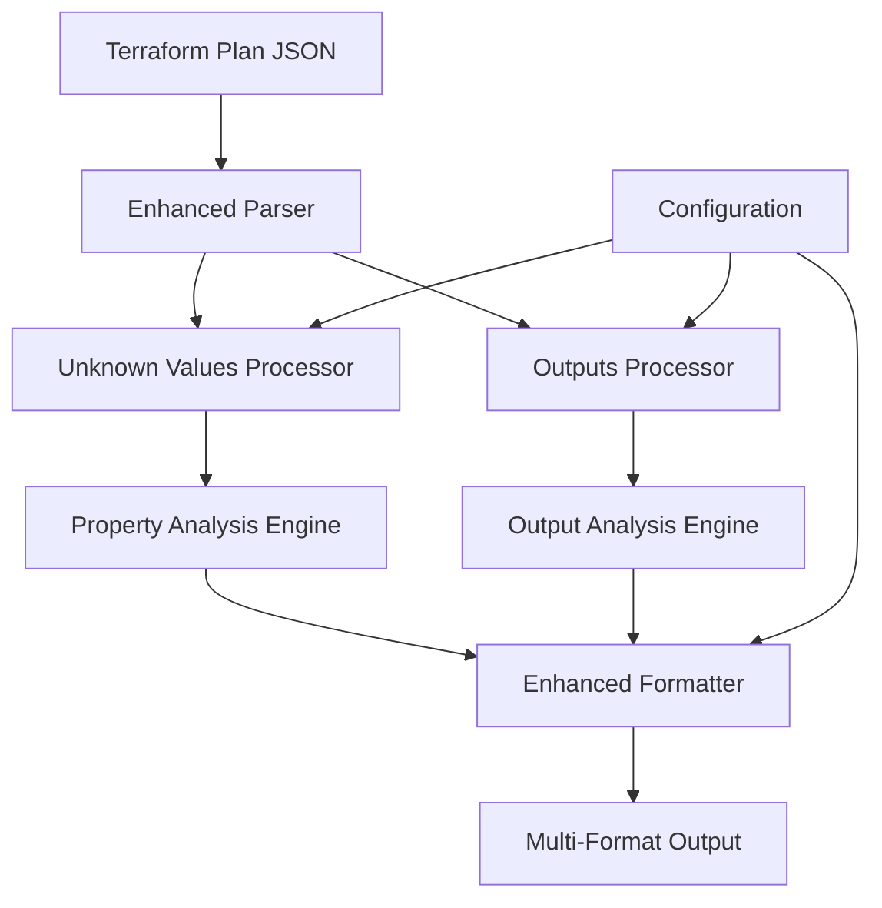

# Terraform Unknown Values and Outputs Feature Design

## Overview

This feature enhances the Strata Terraform plan summary tool to provide complete parity with Terraform's native output by properly handling unknown values and adding comprehensive outputs display. The feature addresses two core issues:

1. **Unknown Values**: Currently, properties marked as unknown in Terraform's `after_unknown` field are incorrectly displayed as deletions instead of showing `(known after apply)`
2. **Outputs Display**: Missing dedicated outputs section to show changes to Terraform output values

## Architecture

### High-Level Architecture



### Integration Points

The feature integrates with existing Strata components:

- **Parser Layer** (`lib/plan/parser.go`): Enhanced to extract `after_unknown` and `output_changes` fields
- **Analyzer Layer** (`lib/plan/analyzer.go`): Extended with unknown value detection and output processing
- **Formatter Layer** (`lib/plan/formatter.go`): Enhanced to display unknown values and outputs consistently
- **Models Layer** (`lib/plan/models.go`): Extended with unknown value tracking and output models

## Components and Interfaces

### 1. Unknown Values Processing

**Purpose**: Integrate `after_unknown` field processing directly into existing property analysis to identify unknown values.

**Implementation Approach**: 
Rather than creating a separate processor, extend the existing `compareObjects` function to consult `after_unknown` during property comparison. This approach:
- Eliminates redundant data structures and memory overhead
- Integrates seamlessly with existing logic
- Avoids path-based tracking complexity
- Maintains performance characteristics

```go
// Enhanced compareObjects signature to include after_unknown
func (a *Analyzer) compareObjects(
    path string, 
    before, after, beforeSensitive, afterSensitive any, 
    afterUnknown any, // New parameter
    replacePathStrings []string, 
    analysis *PropertyChangeAnalysis
)

// Helper function for unknown value detection
func (a *Analyzer) isValueUnknown(afterUnknown any, path string) bool

// Display helper
func (a *Analyzer) getUnknownValueDisplay() string // Returns "(known after apply)"
```

**Implementation Details**:
- Directly consult `after_unknown` during property comparison rather than pre-processing
- When `after` value is `null` but `after_unknown` indicates the property exists, display `(known after apply)`
- No separate tracking structures needed - process on-demand during comparison
- Maintain existing performance limits and patterns

### 2. Outputs Processing

**Purpose**: Extract and process output changes from Terraform plan data directly in the analyzer.

**Implementation Approach**: 
Add outputs processing directly to the existing `Analyzer` rather than creating a separate processor. This approach:
- Keeps outputs processing simple and straightforward
- Avoids unnecessary abstraction for a relatively simple feature
- Reuses existing patterns and helper functions

```go
// Add to existing Analyzer struct
func (a *Analyzer) ProcessOutputChanges(plan *tfjson.Plan) ([]OutputChange, error)

// Helper for individual output analysis
func (a *Analyzer) analyzeOutputChange(name string, change *tfjson.Change) (*OutputChange, error)
```

**Implementation Details**:
- Process output changes directly from plan's `OutputChanges` field during analysis
- Handle sensitive output detection using existing sensitive value patterns
- Apply unknown value logic consistently with resource properties
- Simple categorization as Add/Modify/Remove with visual indicators (+, ~, -)

### 3. Enhanced Property Analysis

**Purpose**: Extends existing property analysis to handle unknown values.

```go
// Enhanced PropertyChange struct
type PropertyChange struct {
    Name                string   `json:"name"`
    Path                []string `json:"path"`
    Before              any      `json:"before"`
    After               any      `json:"after"`
    Sensitive           bool     `json:"sensitive"`
    Size                int      `json:"size"`
    Action              string   `json:"action"`
    TriggersReplacement bool     `json:"triggers_replacement"`
    // New fields for unknown values
    IsUnknown           bool     `json:"is_unknown"`           // Whether this property has unknown values
    UnknownType         string   `json:"unknown_type"`         // "before", "after", "both"
}
```

**Integration**: Extends existing `PropertyChangeAnalysis` in `models.go` to include unknown value handling.

## Data Models

### Enhanced Resource Change Model

```go
// ResourceChange enhanced with unknown value support
type ResourceChange struct {
    // Existing fields...
    Address          string          `json:"address"`
    Type             string          `json:"type"`
    Name             string          `json:"name"`
    ChangeType       ChangeType      `json:"change_type"`
    // ... other existing fields
    
    // New fields for unknown values
    HasUnknownValues bool            `json:"has_unknown_values"`    // Whether resource has any unknown values
    UnknownProperties []string       `json:"unknown_properties"`    // List of unknown property paths
    PropertyChanges  PropertyChangeAnalysis `json:"property_changes"` // Enhanced with unknown support
}
```

### Output Change Model

```go
// OutputChange represents a change to a Terraform output (already exists, enhanced)
type OutputChange struct {
    Name       string     `json:"name"`
    ChangeType ChangeType `json:"change_type"`
    Sensitive  bool       `json:"sensitive"`
    Before     any        `json:"before,omitempty"`
    After      any        `json:"after,omitempty"`
    // New fields for unknown values
    IsUnknown  bool       `json:"is_unknown"`     // Whether output value is unknown
    Action     string     `json:"action"`         // "Add", "Modify", "Remove"
    Indicator  string     `json:"indicator"`      // "+", "~", "-"
}
```

### Simplified Unknown Values Handling

No separate data structures needed. Unknown value detection happens on-demand during property comparison by consulting the `after_unknown` field directly from the Terraform plan data.

## Error Handling

### Unknown Values Processing

1. **Missing after_unknown Field**: 
   - Gracefully degrade to standard processing
   - Log warning for debugging
   - Continue with existing behavior

2. **Malformed after_unknown Structure**:
   - Validate structure before processing
   - Skip unknown value processing for affected resources
   - Return descriptive error messages

3. **Memory Limits**:
   - Apply existing performance limits to unknown value processing
   - Truncate unknown property lists if they exceed limits
   - Maintain consistent behavior with existing property analysis

### Outputs Processing

1. **Missing output_changes Field**:
   - Return empty outputs list (suppress empty section)
   - Continue normal resource processing
   - No error thrown for plans without outputs

2. **Invalid Output Structure**:
   - Skip malformed output entries
   - Log warning with output name
   - Process remaining valid outputs

3. **Large Output Values**:
   - Apply size limits consistent with property analysis
   - Truncate large output values with indication
   - Maintain performance within existing limits

## Testing Strategy

### Unit Tests

1. **Unknown Values Processing**:
   ```go
   func TestUnknownValuesProcessor_ProcessUnknownValues(t *testing.T)
   func TestUnknownValuesProcessor_IsPropertyUnknown(t *testing.T)
   func TestUnknownValuesProcessor_GetUnknownValueDisplay(t *testing.T)
   ```

2. **Outputs Processing**:
   ```go
   func TestOutputsProcessor_ProcessOutputChanges(t *testing.T)
   func TestOutputsProcessor_AnalyzeOutputChange(t *testing.T)
   ```

3. **Integration with Existing Analysis**:
   ```go
   func TestAnalyzer_ProcessResourceChangeWithUnknownValues(t *testing.T)
   func TestAnalyzer_GenerateSummaryWithOutputs(t *testing.T)
   ```

### Integration Tests

1. **End-to-End Unknown Values**:
   - Test with real Terraform plan containing unknown values
   - Verify correct display of `(known after apply)`
   - Ensure integration with danger highlighting

2. **End-to-End Outputs**:
   - Test plans with various output change types
   - Verify outputs section placement and formatting
   - Test sensitive output handling

3. **Cross-Format Consistency**:
   - Test unknown values across all output formats (table, JSON, HTML, Markdown)
   - Verify outputs display consistency across formats
   - Test collapsible sections integration

### Test Data

1. **Unknown Values Test Plans**:
   ```json
   {
     "resource_changes": [{
       "change": {
         "after": {"ami": "ami-123", "id": null},
         "after_unknown": {"id": true, "vpc_security_group_ids": true}
       }
     }]
   }
   ```

2. **Outputs Test Plans**:
   ```json
   {
     "output_changes": {
       "instance_ip": {
         "actions": ["create"],
         "after": null,
         "after_unknown": true,
         "after_sensitive": false
       }
     }
   }
   ```

### Edge Case Testing

1. **Complex Unknown Structures**:
   - Nested objects with mixed known/unknown values
   - Arrays with unknown elements
   - Complex data types with partial unknown values

2. **Output Edge Cases**:
   - Sensitive outputs with unknown values
   - Empty outputs section
   - Large output values

3. **Performance Testing**:
   - Large plans with many unknown values
   - Memory usage with extensive unknown property tracking
   - Processing time impact measurement

## Implementation Details

### Phase 1: Unknown Values Implementation

1. **Extend Models** (`lib/plan/models.go`):
   - Add minimal unknown value fields to `PropertyChange` 
   - Add basic unknown tracking to `ResourceChange`

2. **Enhance Parser** (`lib/plan/parser.go`):
   - No changes needed (already extracts full plan JSON)

3. **Extend Analyzer** (`lib/plan/analyzer.go`):
   - Modify `compareObjects` to accept `after_unknown` parameter
   - Add simple unknown value detection logic
   - Integrate unknown value display in property comparison

4. **Update Formatter** (`lib/plan/formatter.go`):
   - Add unknown value display logic
   - Ensure `(known after apply)` appears consistently
   - Integrate with existing danger highlighting

### Phase 2: Outputs Implementation

1. **Enhance Models**:
   - Update `OutputChange` with minimal new fields

2. **Extend Analyzer**:
   - Add simple outputs processing method
   - Extract output changes from plan directly
   - Apply unknown value logic to outputs

3. **Update Formatter**:
   - Add outputs section rendering
   - Implement 5-column table format
   - Handle sensitive output masking

4. **Integrate with Existing Workflow**:
   - Add outputs processing to main summary generation
   - Ensure outputs section appears after resource changes

### Technical Considerations

1. **Memory Management**:
   - Minimal memory overhead with on-demand processing
   - Reuse existing performance limits and patterns
   - No additional data structures needed

2. **Backward Compatibility**:
   - All changes are additive to existing models
   - Existing functionality remains unchanged
   - Graceful degradation for missing fields

3. **Performance Impact**:
   - Minimal computational overhead with direct field consultation
   - Leverage existing patterns in analyzer
   - No complex path-based lookups needed

## Decision Points Addressed

Based on the decision log, the following design decisions are implemented:

1. **Unknown Value Representation**: Use exact Terraform syntax `(known after apply)`
2. **Data Format Consistency**: Display as string across all output formats
3. **Outputs Section Design**: 5-column table placed after resource changes
4. **Sensitive Output Handling**: Display `(sensitive value)` with ⚠️ indicator
5. **Empty Outputs Section**: Suppress when no output changes exist
6. **Edge Case Handling**: Follow Terraform's standard behavior patterns

## Future Enhancements

1. **Progressive Disclosure for Outputs**: Add collapsible sections for large output values
2. **Output Dependency Tracking**: Show relationships between outputs and resources
3. **Advanced Unknown Value Analysis**: Provide insights about what triggers unknown values
4. **Output Change Impact**: Analyze downstream effects of output changes

## Compatibility

- **Terraform Versions**: Compatible with Terraform 0.12+ (JSON plan format)
- **Plan Formats**: Works with both binary plans (via `terraform show -json`) and JSON plans
- **Strata Versions**: Backward compatible with existing Strata functionality
- **Output Formats**: Consistent across table, JSON, HTML, and Markdown outputs